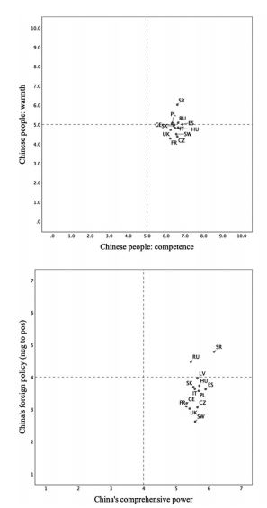
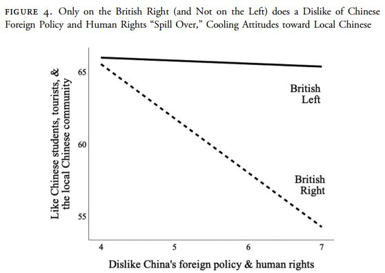

```{r setup, include=FALSE}
# to use FontAwesome
#htmltools::tagList(rmarkdown::html_dependency_font_awesome())
library(fs)
library(fontawesome)
# library(magick)  
library(ggplot2)
knitr::opts_chunk$set(warning = FALSE, message = FALSE, error=F, echo=F)
options(htmltools.preserve.raw = FALSE)
```


class: inverse, bottom, right, clear
background-image: url(http://www.rafu.com/wp-content/uploads/2015/07/Vincent-Chin-Rally-30.jpg)
background-size: cover

# .huge[Globaliztion in Asia] <br> (GLOA 400) <br> Asian Hate and the Pandemic 

---


.pull-left[

]

---

class: inverse, middle
background-color: #A188AC
background-image: url(https://media.newyorker.com/photos/605e296db707becb8be3256e/master/pass/cover-STORYimage-kikuo_johnson_subway.jpg)
background-position: right, bottom
background-size: 42%

# .Large[.orange[What we talk about:] ]

--

# 1. What is the .yellow[nature] of the Hate?

--

# 2. Did the .yellow[pandemic] contribute to it?

--

# 3. What are the .yellow[consequences]?

--

# 4. on a .yellow[global] context


---

class: left, middle
background-image: url(https://c.tenor.com/GuGV3alDVGIAAAAM/im-not-really-in-the-mood-to-be-a-victim-of-a-hate-crime-tonight-david.gif)
background-size: contain
background-position: right

# Asian Hate Crimes <br> are really .red[not] known <br> (in the Western World):

--

# - small in size

--

# - 'model immigrants'

--

# - weak organization effort

---
<div class="full-width-tinted">
  <h1 style="font-size:70px">Is it (only) white supremacy that's at work?</h1>
</div><br><br>

--

.blockquote[
### "This pervasiveness of ... .black[white supremacy] ... to the body politic of the United States, a body politic ... that in our political, cultural, and social imaginations remains overwhelming white, are dealt with forcefully and without much forethought. Meaning, anytime there has been .blue[a threat to the US] from an Asian nation ... people in the US have their axiety ... against any subjects associated with the Asian-enemy" .black[Ho (2020, 152)]]

--
<br>

## Perpetrators of Anti-Asian Hate Crimes (FBI)

- .Large[70% White]
- .Large[70% Male]

---
class: inverse
background-color: black

<div class="full-width-tinted"><br>
  <h1 style="font-size:55px"> If .yellow[just] White Supremacy, similar for .red[all] minorities? </h1>
</div><br><br>

## **Reny and Barreto (2020)**

- .large['Othering' H: disease`r fa("virus", fill='red')` + stigmatized group `r fa("hand-pointer", fill='orange')` => blame `r fa("head-side-virus", fill="yellow")`! : only Asians]

- .large['behavioral immune system' H: .yellow[all] minorities]
<br>
--

```{r echo=F, fig.align='center', out.height=300}
knitr::include_graphics("https://github.com/textvulture/textvulture.github.io/blob/master/images/Reny2020.png?raw=true")
```

---

class: inverse, center, middle
background-color: #88ACA4

# .Huge[**Only an <br> .blue[American] thing?**]

---

<div class="full-width-tinted">
  <h1> .large[Anti-Asian Hate or Anti-CCP?] .yellow[European] Examples</h1>
</div><br>

--

# Gries and Turscanyi (2021) 

--

## - Anti-CCP sentiment .red[spills over] onto local Chinese [stereotyping].

--

## - Ideology .red[moderates] the spill-over effect.

--

# The Survey 

- .LARGE[13 European countries (n=19k), Fall 2020]
- .LARGE[.red[How are the Chinese people viewed in your country?]]
- .LARGE[.orange[How positively do you assess the foreign policy of [China]?]]

---

class: inverse
background-color:black

.pull-left[
.center[

]
]

.pull-right[
.center[

]
<br>
<br>
# .huge[The Result]

]


---

<div class="full-width-tinted">
  <h1> .Large[A bigger picture]</h1>
</div><br>

## What are the effects of the spill-over?

--

### - `r fa("user-tag")` A related study on .red[Chinese Students] in America (Fan et al. 2020)

--

### - anti-CCP comments: .red[`r fa("bell-slash")`], but racist comments: .green[`r fa("bell")`]

--

## `r fa("exclamation")` populist and/or nationalist political .red[elites] benefit from this mess (negative feedback structure)

--

### : .red[anti-CCP] ('China Virus') -> anti-Chinese sentiment in the West -> anti-West sentiment in China -> CCP & Western Populist emboldened ---> .red[anti-CCP]?

---

background-image: url(https://media2.giphy.com/media/dB16tYGyHzov7EzN5D/giphy.gif)
background-size: contain

