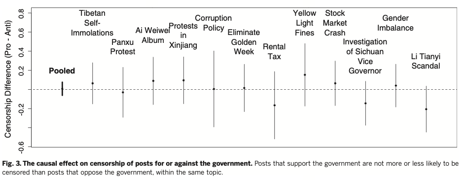

```{r setup, include=FALSE}
# to use FontAwesome
#htmltools::tagList(rmarkdown::html_dependency_font_awesome())
library(fs)
library(fontawesome)
# library(magick)  
library(ggplot2)

#setwd("/Users/bson3/Documents/GitHub/textvulture.github.io/")
#setwd("/Users/kalka/Documents/GitHub/textvulture.github.io/")

```

class: inverse, bottom, right
background-image: url(https://www.bloomberg.com/graphics/2019-hong-kong-protesters-umbrellas/img/2019-hong-kong-protesters-umbrellas-facebook.png)
background-size: contain
background-position: left
background-color: black

# .large[.green[Political Freedom in Asia]] 

# GLOA 400-001

---
class: inverse
background-image: url(https://c.tenor.com/nBu63g7QuK0AAAAC/amy-poehler-high-five.gif)
background-size: cover

# Political Globalization: more .yellow[political freedom]

---

class: inverse, center, middle
background-image: url(https://preventionlane.org/wp-content/uploads/2015/02/blackboard.jpg)
background-size: cover

# .huge[What does political freedom (and globalization) look like in Asia?]


---

# Freedom House (inversed index) -- which one is which?

--
.center[
```{r, echo=FALSE, out.width = '70%'}
knitr::include_graphics('images/fh-asia.png')
```
]

---

class: inverse
background-image: url('images/fh-img.png')
background-size: contain

# Political Freedom in Hong Kong: 'Partly Free'
---

class: inverse
background-image: url('images/hk-election.png')

# .red[1.Electoral Roll-back]
---

background-image: url(https://www.reuters.com/investigates/special-report/assets/hongkong-protests-extradition-narrative/RTS2ICNT.jpg?v=134011231219)
class: inverse

# 2.Extradition Bill (and abductions)

---
class: inverse
background-image: url(https://i.ytimg.com/vi/LJnt1FvCDbQ/maxresdefault.jpg)

# .yellow[3.Brutal Repressions and Vicious Cycle]

---

class: inverse, middle
background-color: black

.center[
# .huge[Now, Online Censorship in China]
]

---
class: inverse, right
background-image: url(https://media0.giphy.com/media/i4jKn7itdV2Tvjzj6Y/giphy.gif)
background-size: contain

# globalization :: connectivity :: internet

--

# censorship :: de-globalization

---

# How does it work? (King, Pan, and Roberts 2014)

- .Large[online experiments + participatory observation + interviews]

- .Large[the .green[types] of posts focused on]

.Large[
|                 	| .red[non-collective action] 	| .blue[collective action] 	|
|:---------------:	|:---------------------:	|:-----------------:	|
|  .red[pro-government] 	|           1           	|         2         	|
| .blue[anti-government] 	|           3           	|         4         	|
]

# 

--

# which one is most likely censored?

---

# The Result (Figure 2)

.center[
```{r, echo=FALSE}
knitr::include_graphics('images/King2014_1.png')
```
]

---

# The Result (Figure 3)

.center[
```{r, echo=FALSE, out.width='180%'}

```
]

---
class: inverse
background-image: url(https://preventionlane.org/wp-content/uploads/2015/02/blackboard.jpg)

# Finding 1

# : The authorities are worried about '.yellow[collective action]' contents

# Finding 2

# : Not much worried about .yellow[anti-government] contents

--

# But wouldn't the censorship too obvious?

--

# As a complementary strategy, CCP employs '.green[distraction]' tactics