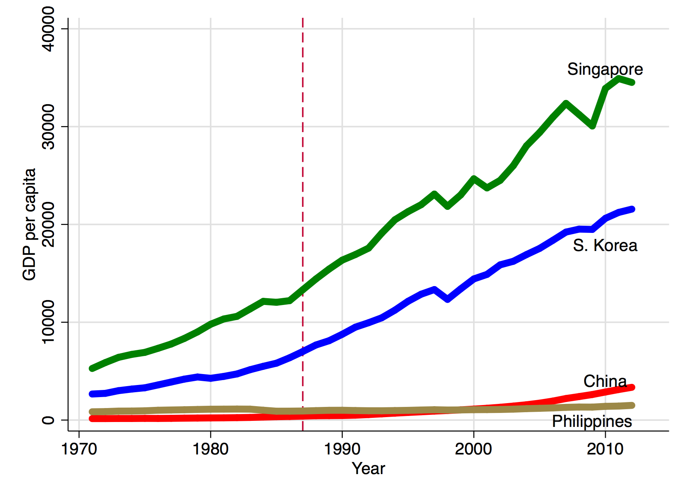
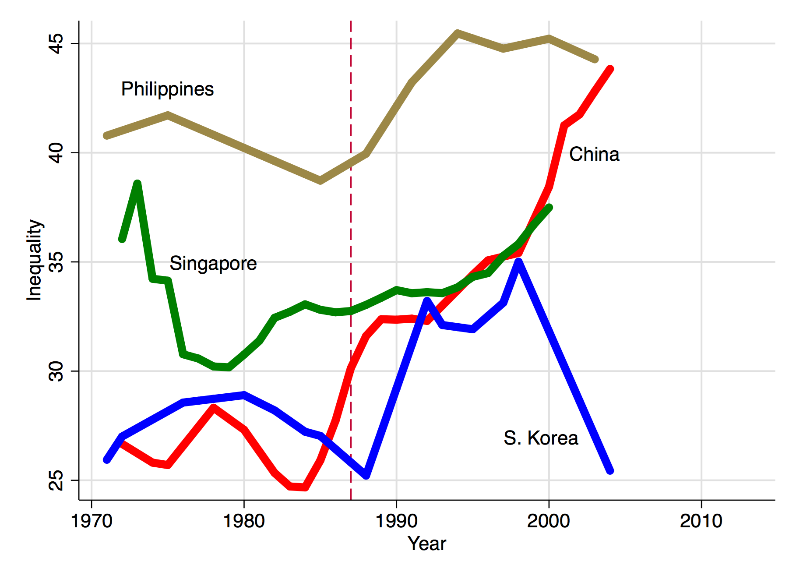
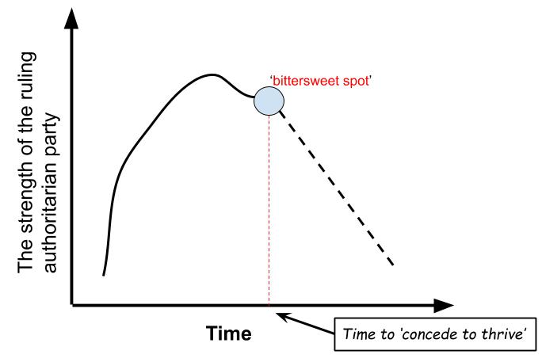

```{r setup, include=FALSE}

# to use FontAwesome
#htmltools::tagList(rmarkdown::html_dependency_font_awesome())
#remotes::install_github("coolbutuseless/flagon")
library(fs)
library(fontawesome)
options(htmltools.preserve.raw = FALSE)
library(ggplot2)
library(dplyr)

```

class: inverse, top, center
background-image: url(https://images.squarespace-cdn.com/content/v1/5497331ae4b0148a6141bd47/1529717706598-9KB3VOGO0G1BGOOXMJ3U/BLOG-podcast-populism-the-new-populism-1482659671-9641-005.jpg?format=1500w)
background-size: 100%
background-position: center
background-color: black

# .Large[**Autocratization and Populism in Asia**] <br> GLOA 400

---

class: inverse, center, middle
background-color: #19194d

# .huge[Why Do We Care?]

--

# .Large[Because, .yellow[Political Globalization]]

---

class: inverse, left, middle
background-image: url(https://media.giphy.com/media/ZW44yxLZRDdNS/giphy.gif)
background-size: 55%
background-position: right

--

# When people think about <br>.pink[political globalization],

--

# they often think of a <br>.yellow[**World Government**].


---

class: inverse
background-image: url(https://substackcdn.com/image/fetch/f_auto,q_auto:good,fl_progressive:steep/https%3A%2F%2Fbucketeer-e05bbc84-baa3-437e-9518-adb32be77984.s3.amazonaws.com%2Fpublic%2Fimages%2Ff07da747-42f8-4bb6-a36a-41fbc3b5803f_228x276.gif)
background-size: contain
background-position: right
background-color: black

# Actually, .red[not] entirely crazy. <br> Political globalization entails:

--

## - importance of .green[institutions]

## - homogenization of the .red[form] of poltics

--

# These conditions then .Green[further] <br>accelerate political globalization.

--

### Crumbling democratic institutions <br>`r fa("hand-point-left", fill="purple")``r fa("hand-point-right", fill="orange")` political .pink[deglobalization].

---

# What kind of .pink[*homogeneization*]? (.green[V-dem] data)

--

```{r echo=FALSE, error=FALSE, message=FALSE, warning=FALSE, fig.width=20, fig.height=9, cache=TRUE}

library(vdemdata)
library(tidyverse)

df <- vdem %>%
  select(year, v2x_polyarchy, v2x_libdem) %>%
  gather(key="variable", value="value", -year)

ggplot(df, aes(x = year, y=value)) +
  geom_smooth(aes(color=variable)) +
  geom_point(aes(color=variable), size=2, alpha=1/25) +
  labs(x = "year", y="Democracy Index") +
  theme_minimal() +
  scale_color_manual(labels = c("Electoral Democracy", "Liberal Democracy"),
                     values = c("blue", "red")) +
  theme(axis.text=element_text(size=30),
        axis.title=element_text(size=35),
        legend.position = "bottom",
        legend.text=element_text(size=35),
        legend.title = element_blank()) 

```

---

class: inverse, middle
background-color: black
background-image: url(https://www.visualcapitalist.com/wp-content/uploads/2023/04/Democracy_Around_the_World_2022_Asia.jpg)
background-position: right
background-size: contain


# Status of democracy <br> `r fa("hand-point-right")` .red[political globalization]

--

## - .Green[democratization] cases in Asia

- .large[🇹🇼 Taiwan]
- .large[🇰🇷 S. Korea]
- .large[🇮🇩Indonesia]

## - .orange[autocratization] cases in Asia

--

- .large[🇵🇭 the Philippines (populism)]
- .large[🇰🇭 Cambodia (backsliding)]

---

class: inverse, middle, center
background-color: black
background-image: url(https://t4.ftcdn.net/jpg/01/26/47/67/360_F_126476734_u4kON6kiQHn8TBv0TStYsqV9HDgNQUFA.jpg)
background-size: 120%

# .Large[.yellow[What does political globalization (democratization) in Asia look like?]]

--

# .bluey[How textbook explanations don't work in Asia.]

---


# Textbook #1: democratization happens with .red[economic development] (GDP per capita)

--

.center[
```{r, echo=FALSE, out.width='60%'}

```
]

---

# Textbook #2: democratization happens with increasing .red[income inequality] (Gini index)

--

.center[
```{r, echo=FALSE, out.width='60%'}

```
]

---

class: inverse, left
background-image: url(https://www.wired.com/wp-content/uploads/2015/03/855.gif)
background-size: cover

# .Large[Then how <br> do we explain <br> the .yellow[Asian] cases?]

---
class: inverse

.pull-left[
# Hint: most democratization episodes are .yellow[not] revolutions.
.center[ 
```{r, echo=FALSE, out.width='120%'}
knitr::include_graphics(path="https://c.tenor.com/tOVFV6hNMsIAAAAM/lenin-vladimir-lenin.gif")
```
]
]

--

.pull-right[
# They are instead the stories of .red[elite concessions].
.center[
```{r, echo=FALSE, out.width='90%'}
knitr::include_graphics(path="https://c.tenor.com/gwN3ilPlMaIAAAAC/nick-offerman-ron-swanson.gif")
```
]
]

---

class: inverse
background-color: #6b5b95

# So when do dictators concede? (Slater & Wong 2003)

--


### - Asian Developmental States: Taiwan, South Korea, Indonesia

--

.center[
```{r, echo=FALSE, out.width='60%'}

```
]

---

# The tales of going backward: the Philippines & Cambodia

```{r, echo=FALSE, warning=FALSE, message=FALSE, fig.width=16}

library(vdem) #remotes::install_github("xmarquez/vdem")
library(dplyr)

df <- extract_vdem(
  include_sd = TRUE,
  name_pattern = "v2x_polyarchy"
) 

df %>% 
  filter(year>1970) %>%
  rename(country = vdem_country_name) %>%
  filter(country == "Philippines" | country == "Cambodia")  %>%  
  ggplot(aes(x = year, 
             y= v2x_polyarchy,
             color=country)) +
    geom_line(size=2, alpha=1) +
    geom_ribbon(aes(ymin=v2x_polyarchy_codelow, 
                    ymax=v2x_polyarchy_codehigh,
                    x=year, fill=country, 
                    alpha=1/15)) +
  theme(legend.text = element_text(size=20),
        axis.text=element_text(size=20),
        axis.title=element_text(size=20)) +
  guides(alpha = 'none') +
  labs(y="Democracy Index")


```

---

class: inverse, top, right
background-image: url(https://arc-anglerfish-arc2-prod-pmn.s3.amazonaws.com/public/7DWQUYSNFVC25DQAA74RFMA44U.jpg)
background-size: cover

--

# The Philippines: <br> A case of .red[populist] backsliding

--

### - shock to the political .orange[connectedness]

--

### - regional (international) cooperation harder

--

### - US-Phil; Phil-China; ASEAN

---

# .red[Populism]: 

---
# .red[Populism]: .Small[leaders .orange[un]constrained in the name of .pink['the people']]

--

<br>
.center[

]

---

# The Philippines: A breeding ground for populism <br>(Arugay & Slater 2019)

<br>
<br>

.center[
```{r, echo=FALSE, out.width='120%'}
knitr::include_graphics("https://github.com/textvulture/textvulture.github.io/blob/master/images/Phil_timeline.jpg?raw=true")
```
]

---

background-color: black
background-image: url(https://assets.bwbx.io/images/users/iqjWHBFdfxIU/iPpGrFZB6NGY/v0/-1x-1.png)
background-size: contain

---

background-image: url(https://github.com/textvulture/textvulture.github.io/blob/master/images/Gasuya2023.png?raw=true)
background-position: right
background-size: 30%


# Different Reasons

## Kasuya & Miwa (2023)

## Experiments in the Philippines


---

class: inverse, center
background-size: contain
background-image: url(https://live-production.wcms.abc-cdn.net.au/8b2a54a026fd4dfab36ca9dcc2a25da3?impolicy=wcms_crop_resize&cropH=2658&cropW=4726&xPos=0&yPos=493&width=862&height=485)

# .huge[the epilogue]

---

class: inverse, center, middle
background-color: black

# .huge[Backsliding in Cambodia]

---

background-image: url(https://www.democratic-erosion.com/wp-content/uploads/2018/03/HUN-SEN.jpg)
background-size: contain

---

class: inverse
background-color: #6b5b95

# Cambodian Backsliding and China (Loughlin 2021)

--

## A reaction to a political 'crisis': CNRP's rise (2012) and fall (2017)

--

  - .Large[from .yellow[competitive] to .red[hegemonic] authoritarianism]
  - .Large[result: single-party election in 2018 (Cambodian People's Party)]

--

## - "authoritarian linkage" 

--

  - .Large[elite cooperation: investment from China] 
   - .Large[.orange[business tycoons]; .orange[military]].Large[: -> against Western pressure]
  - .Large[Chinese discourse] -> .Large[justification for repression]
  - .Large['.yellow[non-interference]' & '.yellow[right to develop]']
  - .Large[CNRP a 'Trojan Horse' of US]
  
---

class: inverse, top, left
background-image: url(https://media1.giphy.com/media/4lYRJD6tcidlC/200.gif)
background-size: contain

# .yellow[Asian political globalization runs *both* ways]

--

# Some democratization with some backsliding


