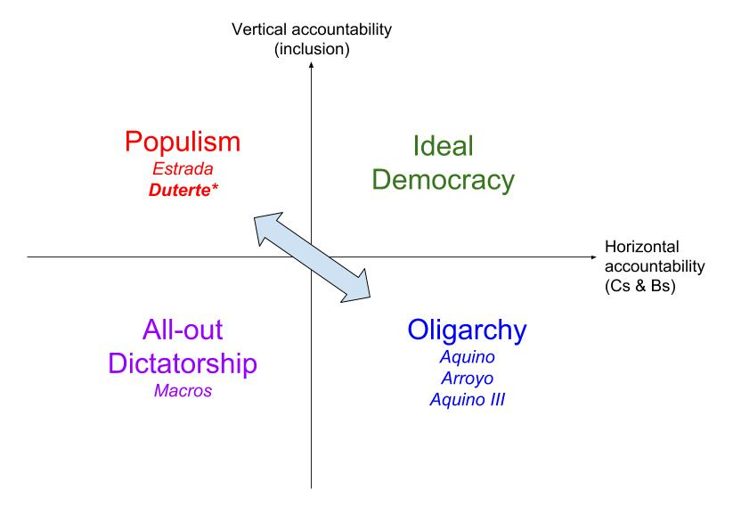
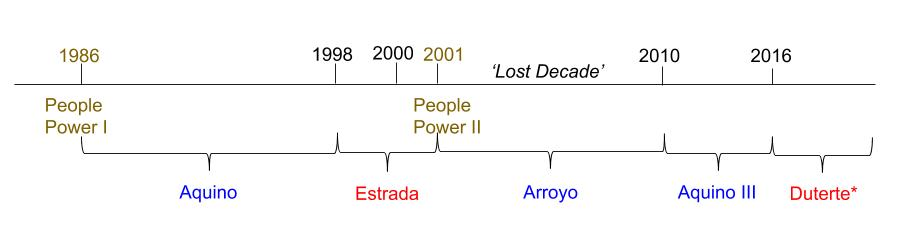

```{r setup, include=FALSE}
# to use FontAwesome
#htmltools::tagList(rmarkdown::html_dependency_font_awesome())
#remotes::install_github("coolbutuseless/flagon")
library(fs)
library(fontawesome)
library(magick)  
library(ggplot2)
library(emo)
library(flagon)

#setwd("/Users/bson3/Documents/GitHub/textvulture.github.io/")
#setwd("/Users/kalka/Documents/GitHub/textvulture.github.io/")

```

class: inverse, top, center
background-image: url(https://images.squarespace-cdn.com/content/v1/5497331ae4b0148a6141bd47/1529717706598-9KB3VOGO0G1BGOOXMJ3U/BLOG-podcast-populism-the-new-populism-1482659671-9641-005.jpg?format=1500w)
background-size: contain
background-position: center
background-color: black

# .Large[**Autocratization and Populism in Asia**] <br> GLOA 400


---

class: inverse, center, middle
background-color: #19194d

# .huge[Why Do We Care?]

--

# .Large[Because, .yellow[Political Globalization]]

---

class: inverse, left, top
background-image: url(https://media.giphy.com/media/ZW44yxLZRDdNS/giphy.gif)
background-size: contain

--

# .Large[When people think about political globalization,]

--

# .Large[they often think of a 'World Government.']


---

class: inverse
background-image: url(https://substackcdn.com/image/fetch/f_auto,q_auto:good,fl_progressive:steep/https%3A%2F%2Fbucketeer-e05bbc84-baa3-437e-9518-adb32be77984.s3.amazonaws.com%2Fpublic%2Fimages%2Ff07da747-42f8-4bb6-a36a-41fbc3b5803f_228x276.gif)
background-size: contain
background-position: right
background-color: black

# .Large[Actually, <br> .red[not] entirely crazy], <br> bc political globalization entails:

--

## `r fa("share", fill="yellow")` homogenization of the .red[form] of poltics

--

## `r fa("chart-line", fill="yellow")` rise of institutions

---

# What homogeneization? (.green[V-dem] data)

--

```{r echo=FALSE, error=FALSE, message=FALSE, warning=FALSE, fig.width=20, fig.height=9, cache=TRUE}
library(vdemdata)
library(tidyverse)

df <- vdem %>%
  select(year, v2x_polyarchy, v2x_libdem) %>%
  gather(key="variable", value="value", -year)

ggplot(df, aes(x = year, y=value)) +
  geom_smooth(aes(color=variable)) +
  geom_point(aes(color=variable), size=2, alpha=1/25) +
  labs(x = "year", y="Democracy Index") +
  theme_minimal() +
  scale_color_manual(labels = c("Electoral Democracy", "Liberal Democracy"),
                     values = c("blue", "red")) +
  theme(axis.text=element_text(size=30),
        axis.title=element_text(size=35),
        legend.position = "bottom",
        legend.text=element_text(size=35),
        legend.title = element_blank()) 

```
---

class: inverse, middle
background-color: #563f46

# So, what we're talking about matters <br> for .red[political globalization]

--

## `r fa("leaf")` democratization cases in Asia

## `r fa("leaf")` backsliding cases in Asia

--

### - the Philippines (populism)

### - Cambodia (backsliding)

---

class: inverse, middle, center
background-color: black

# .Large[What does political globalization (democratization) in Asia look like?]

--

# .red[confusing], because the traditional, textbook explanations don't work here.

---


# Textbook #1: democratization happens with .red[economic development] (GDP per capita)

--

.center[
```{r, echo=FALSE, out.width='60%'}
knitr::include_graphics('images/gdp400.png')
```
]

---

# Textbook #2: democratization happens with increasing .red[income inequality] (Gini index)

--

.center[
```{r, echo=FALSE, out.width='60%'}
knitr::include_graphics('images/gini400.png')
```
]

---

class: inverse, left
background-image: url(https://www.wired.com/wp-content/uploads/2015/03/855.gif)
background-size: cover

# .Large[Then how <br> do we explain <br> the .yellow[Asian] cases?]

---
class: inverse

.pull-left[
# Hint: most democratization episodes are .yellow[not] revolutions.
.center[ 
```{r, echo=FALSE, out.width='120%'}
knitr::include_graphics(path="https://c.tenor.com/tOVFV6hNMsIAAAAM/lenin-vladimir-lenin.gif")
```
]
]

--

.pull-right[
# They are instead the stories of .red[elite concessions].
.center[
```{r, echo=FALSE, out.width='90%'}
knitr::include_graphics(path="https://c.tenor.com/gwN3ilPlMaIAAAAC/nick-offerman-ron-swanson.gif")
```
]
]

---

class: inverse
background-color: #6b5b95

# So when do dictators concede? (Slater & Wong 2003)

--


### - Asian Developmental States: Taiwan, South Korea, Indonesia

--

.center[
```{r, echo=FALSE, out.width='60%'}
knitr::include_graphics('images/Slater_Wang_2013.jpg')
```
]

---

# The tales of going backward: the Philippines & Cambodia

```{r, echo=FALSE, warning=FALSE, message=FALSE, fig.width=16}

library(vdem) #remotes::install_github("xmarquez/vdem")
library(dplyr)

df <- extract_vdem(
  include_sd = TRUE,
  name_pattern = "v2x_polyarchy"
) 

df %>% 
  filter(year>1970) %>%
  rename(country = vdem_country_name) %>%
  filter(country == "Philippines" | country == "Cambodia")  %>%  
  ggplot(aes(x = year, 
             y= v2x_polyarchy,
             color=country)) +
    geom_line(size=2, alpha=1) +
    geom_ribbon(aes(ymin=v2x_polyarchy_codelow, 
                    ymax=v2x_polyarchy_codehigh,
                    x=year, fill=country, 
                    alpha=1/15)) +
  theme(legend.text = element_text(size=20),
        axis.text=element_text(size=20),
        axis.title=element_text(size=20)) +
  guides(alpha = 'none') +
  labs(y="Democracy Index")


```

---

class: inverse, top, right
background-image: url(https://arc-anglerfish-arc2-prod-pmn.s3.amazonaws.com/public/7DWQUYSNFVC25DQAA74RFMA44U.jpg)
background-size: cover

--

# The Philippines: <br> A case of .red[populist] backsliding

---

# Populism (Arugay & Slater 2019)

.center[

]

---

# The Philippines: A breeding ground for populism

<br>
<br>
<br>

.center[
```{r, echo=FALSE, out.width='120%'}

```
]

---

background-color: black
background-image: url(https://assets.bwbx.io/images/users/iqjWHBFdfxIU/iPpGrFZB6NGY/v0/-1x-1.png)
background-size: contain

---

class: inverse, center, middle
background-color: black

# .huge[Backsliding in Cambodia]

---

background-image: url(https://www.democratic-erosion.com/wp-content/uploads/2018/03/HUN-SEN.jpg)
background-size: contain

---

class: inverse
background-color: #6b5b95

# Cambodian Backsliding and China (Loughlin 2021)

--

## `r fa("feather")` reaction to a political 'crisis': CNRP's rise (2012) and fall (2017)

--

  - .Large[from .yellow[competitive] to .red[hegemonic] authoritarianism]
  - .Large[result: single-party election in 2018 (Cambodian People's Party)]

--

## `r fa("feather")` "authoritarian linkage" 

--

  - .Large[elite cooperation: investment from China] 
   - .Large[.orange[business tycoons]; .orange[military]].Large[: `r fa("shield")` against Western pressure]
  - .Large[`r fa("download")` Chinese discourse ] `r fa("arrow-right")`` .Large[justification for repression]
  - .Large['.yellow[non-interference]' & '.yellow[right to develop]']
  - .Large[CNRP a 'Trojan Horse' of US]
  
---

class: inverse, top, left
background-image: url(https://media1.giphy.com/media/4lYRJD6tcidlC/200.gif)
background-size: contain

# .yellow[Asian political globalization runs *both* ways]

--

# Some democratization with some backsliding


