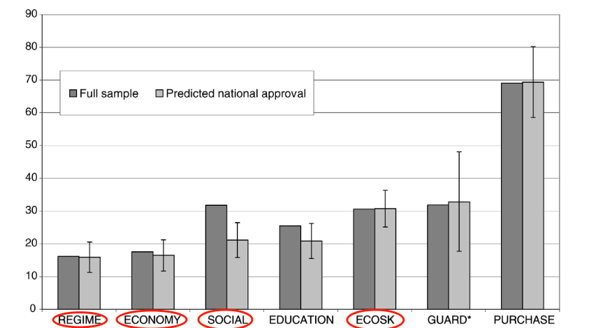

```{r setup, include=FALSE}

# to use FontAwesome
#htmltools::tagList(rmarkdown::html_dependency_font_awesome())
library(fs)
library(fontawesome)
library(ggplot2)
library(dplyr)
options(htmltools.preserve.raw = FALSE)
knitr::opts_chunk$set(warning = FALSE, message = FALSE, error=F, echo=F)

```

class: inverse, center, middle
background-image: url(https://cartoffel.com/wp-content/uploads/2018/11/southeast-asia-globe.jpg)
background-size: cover

# .Huge[**Conflict & Security <br> in Asia** <br> (GLOA 400)]

---


class: inverse, center, middle
background-color: #d64161

# .huge[Globalization and Security]

--

# Does globalization make the world peaceful?

---

background-image: url(http://media3.giphy.com/media/26tOW2rFXxIT3BPeE/giphy.gif)
background-size: contain

---
class: inverse, center, middle
background-color: #d64161

# Could be .yellow[yes]: 'democratic' & 'capitalist' peace

--

# Could be .blue[no]: more connectivity, more disagreement

--

# What do data say?

---

# Global Data ('Correlates of War')

```{r echo=FALSE, message=FALSE, warning=FALSE, cache=TRUE}

# devtools::install_github("prio-data/priogrid")
# https://rforpoliticalscience.com/category/ucdp-prio/
# install.packages('peacesciencer')
# install.packages('states')

library(vdemdata)
library(reshape2)

df <- vdem %>%
  select(year, 
         COWcode,
         e_civil_war, 
         e_miinteco,
         e_regionpol_6C) %>%
  rename(civil.war = e_civil_war,
         war = e_miinteco,
         region = e_regionpol_6C)


# 6=Asia

df %>%
  group_by(year) %>%
  add_count() -> df

df %>%
  filter(!is.na(civil.war)) %>%
  group_by(year) %>%
  mutate(mean.civilwar = sum(civil.war)/n) -> df

df %>%
  filter(!is.na(war)) %>%
  group_by(year) %>%
  mutate(mean.war = sum(war)/n) -> df

```

```{r echo=FALSE, fig.height=8, fig.width=18, message=FALSE, warning=FALSE, cache=TRUE}
df %>%
  ggplot(aes(x=year, alpha=0.5)) +
  geom_line(aes(y=mean.war, color='a'), size=1.5, ) +
  geom_line(aes(y=mean.civilwar, color='b'), size=1.5, ) +
  labs(x = "Year",
       y = "Average War") + 
  theme_minimal() +
  theme(axis.text=element_text(size=20),
        axis.title=element_text(size=20),
        legend.title=element_text(size=20),
        legend.text=element_text(size=20)) +
        scale_color_manual(name = "War Types",
                           labels = c("Interstate War","Civil War"), 
                           values = c('a'='red', 'b'= 'blue')) +
  scale_alpha(guide = 'none')

```

---


# Asia-Pacific Data ('Correlates of War')

--

```{r echo=FALSE, fig.height=8, fig.width=18, message=FALSE, warning=FALSE, cache=TRUE}
# devtools::install_github("prio-data/priogrid")
# https://rforpoliticalscience.com/category/ucdp-prio/
# install.packages('peacesciencer')
# install.packages('states')

library(vdemdata)
library(reshape2)

df <- vdem %>%
  select(year, 
         COWcode,
         e_civil_war, 
         e_miinteco,
         e_regionpol_6C) %>%
  rename(civil.war = e_civil_war,
         war = e_miinteco,
         region = e_regionpol_6C)


# 6=Asia

df %>%
  group_by(year) %>%
  add_count() -> df

df %>%
  filter(!is.na(civil.war)) %>%
  filter(region==6) %>%
  group_by(year) %>%
  mutate(mean.civilwar = sum(civil.war)/n) -> df

df %>%
  filter(!is.na(war)) %>%
  group_by(year) %>%
  mutate(mean.war = sum(war)/n) -> df


```


```{r echo=FALSE, fig.height=8, fig.width=18, message=FALSE, warning=FALSE, cache=TRUE}

df %>%
  ggplot(aes(x=year, alpha=0.5)) +
  geom_line(aes(y=mean.war, color='a'), size=1.5, ) +
  geom_line(aes(y=mean.civilwar, color='b'), size=1.5, ) +
  labs(x = "Year",
       y = "Average War") + 
  theme_minimal() +
  theme(axis.text=element_text(size=20),
        axis.title=element_text(size=20),
        legend.title=element_text(size=20),
        legend.text=element_text(size=20)) +
        scale_color_manual(name = "War Types",
                           labels = c("Interstate War","Civil War"), 
                           values = c('a'='red', 'b'= 'blue')) +
  scale_alpha(guide = 'none')


```

---
class: inverse, center, middle
background-color: black

# .huge[Potential Complications in Asian Security?]
---


class: inverse, middle, center
background-image: url(https://media.nature.com/lw800/magazine-assets/d41586-019-00990-5/d41586-019-00990-5_16578498.jpg)
background-size: cover

# .HUGE[.yellow[**Complication #1**]]


---

class: inverse, center, middle
background-image: url(https://i.insider.com/545be442ecad046f71028e5a?width=840&format=jpeg)
background-color: black
background-size: contain
# .HUGE[.yellow[**Complication #2**]]

---

class: inverse, middle
background-color: black
background-image: url(https://qph.fs.quoracdn.net/main-qimg-04ac420ad1934526b40764d42b9a78f2-lq)
background-position: right

# - We actually know <br> very .green[little] about NK. 

--

# - But slightly more than .yellow[before].

--

# - Defectors and Tradeers.

--

## `r fa("hand", fill='red')` but a big caveat.


---
class: inverse, bottom, right

background-image: url(https://s.abcnews.com/images/International/north-korea-military-parade1-ap-mem-180208_16x9_992.jpg)
background-size: contain

# .huge[**the obvious: Nuke Threat**] 

--

# .huge[But is it predictable? `r fa("chart-line", fill="orange")`]
---

# A compounder: the media `r fa("tv", fill='orange')` (Kim et al. 2018)

```{r echo=F, out.width='900px'}
knitr::include_graphics('http://textvulture.github.io/images/Kim2018_equation.png')
```

--

```{r echo=F, out.width='1200px'}
knitr::include_graphics('http://textvulture.github.io/images/Kim2018_figure.png')
```

---
class: inverse
background-color: black
background-image: url(https://static.mfah.com/images/escape-from-mogadishu.4969214601134635490.jpg?width=715)
background-position: right
background-size: contain

# .large[.red[Only] Nuke Threats in E. Asia? <br> (Salisbury 2021)]

#  `r fa("user-secret", fill='green')` diplomats as agents
- .Large[brokering, fascilitation & espionage]
- .Large[WMD and conventional arms]

# `r fa("suitcase-rolling", fill='orange')` why prevalent?
- .Large[convenience, privilege, security]


---
class: inverse, left, middle
background-image: url(https://c.tenor.com/RkDlXZgnp9UAAAAC/how-not-dead.gif)
background-size: cover

# .large[**Despite sanctions `r fa("handshake-slash", fill='red')`, <br>the regime hasn't collapsed. <br> Why?**]

---

background-image: url(https://img7.yna.co.kr/photo/yna/YH/2020/09/22/PYH2020092211200001100_P4.jpg)
background-position: right
background-size: 40%

# .Large['.green[Everyday Authoritarianism]'] <br> (Dukalskis & Joo 2021)

## - 23 interviews (cross-checked)

--

## - cracks in the system: 'dualization of life'

.large[
- `r fa('money-bill', fill='green')` marketization

- `r fa('tower-broadcast', fill='red')` information flow

- `r fa('gifts', fill='orange')` corruption
]

--

# `r fa('circle-exclamation', fill='red')` But .red[not] strong enough

---


# '.green[Exit Polls]' (Change et al. 2009): the setting

--

## `r fa("glasses")` &nbsp; A rare glimpse into North Korean society/people

--

## `r fa("clipboard-question")` &nbsp; "Are NK people .red[angry] at their government?"

## `r fa("hand-back-fist")` &nbsp; Any sign of mass-mobilization or .red[collective action]?

--

## `r fa("microphone-lines")` &nbsp; Interview .red[1,300+] NK defectors (used only 700)

## `r fa("face-smile-wink")` &nbsp; A very biased sample

---


# '.green[Exit Polls]' (Change et al. 2009): The findings ('satisfaction')

.center[

]


---
class: inverse
background-color: #0F0639

# '.green[Exit Polls]' (Change et al. 2009): The findings ('satisfaction')

--

## - generally better informed about the outside world than we thought.

  - .Large[the balloons .red[`r fa("fly")`] &nbsp; ain't working]

--

## - citizens understand that the regime does not care.

--

## - regime ratings were generally low; people are dissatisfied.

--

# Then why .red[no] revolution???

---
<div class="full-width-tinted"><br>
  <h1> 
  .center[# One big factor: .red[Fear] (and propaganda)]
 </h1> 
</div><br><br> 


.pull-left[
.center[
```{r echo=FALSE, out.width='60%'}
knitr::include_graphics('https://i.pinimg.com/236x/c3/14/46/c31446ffb3201b08c6141058a281e6af--korean-painting-propaganda-art.jpg')
```
]
]

.pull-right[
.center[
```{r echo=FALSE, out.width='70%'}
knitr::include_graphics('https://i.pinimg.com/originals/32/01/cd/3201cdab29192ce5ed941b2d6857cd1e.jpg')
```
]
]

---

<div class="full-width-tinted"><br>
  <h1> 
  .center['The Authoritarian Toolbox' (Byman & Lind 2010)]
 </h1> 
</div><br><br> 

--

.pull-left[
# Against People (.red[revolution])

### - restrictive social policies

### - manipulation of ideas & info

### - use of force
]

--

.pull-right[
# Against Elites (.red[coup])

### - co-optation

### - manipulation of foreign govt's

### - institutional coup-proofing

]


---

class: inverse, center, middle
background-image: url(https://www.belfercenter.org/sites/default/files/styles/featured_image_1280x515_/public/images/publication/feature/senkaku_islands_dispute_by_al_jazeera_english_8.jpg?h=db7fce1d&itok=yfUI1t9z)
background-size: cover

# .Huge[**Now, territorial disputes**]

--

# South China Sea & Senkaku/Diaoyu Islands

---

class: top, right

background-image: url(https://cms.qz.com/wp-content/uploads/2016/06/spratly-paracel-scarborough-v3.png?quality=75&strip=all&w=1880&h=1058&crop=1)
background-size: contain

# South China Sea Disputes

---
# Mischief Reef, Spratly Islands in 2012 (L) and 2020 (R)

.pull-left[
```{r echo=FALSE, out.width='110%'}
knitr::include_graphics('https://i0.wp.com/amti.csis.org/wp-content/uploads/2018/02/mischief_jan24_2012_qb02_overview_28299305844_o-wm.jpg?zoom=2&w=592&h=453&ssl=1')
```
]

--

.pull-right[
```{r echo=FALSE, out.width='110%'}
knitr::include_graphics('https://i2.wp.com/amti.csis.org/wp-content/uploads/2018/02/Mischief_4_23_2020-webres-WM.jpg?zoom=2&w=785&h=607&ssl=1')
```
]
---
class: inverse, top, center
background-image: url(https://multimedia.scmp.com/south-china-sea-disputes-maps/assets/west_london_reef_afp.jpg)
background-size: contain

# West London Reef (Spratly Islands), 2010 (L) and 2015 (R)

---

class: top, right

background-image: url(https://cms.qz.com/wp-content/uploads/2016/06/spratly-paracel-scarborough-v3.png?quality=75&strip=all&w=1880&h=1058&crop=1)
background-size: contain

# South China Sea Disputes

---

# The Essence of the Disputes (De Castro 2020; Zhao 2020; Wiegand & Beuck 2020)

### general rule: 200 NM EEZ (UNCLOS) ⇒ limited claim to sovereignty: .red[China disputes]

--

.pull-left[
# .red[China]

### - history; 'official takeover' of Parcels (1974) and Mischief Reef (1995)

### - .green[strategic ambiguity -> clarity]

### - economic sanctions

]

--

.pull-right[
# .orange[The Philippines]

### - domestic laws 

### - .green[multilateral, institutional solutions]?

  - .Large[ASEAN; PCA]

### - Duterte ambivalence/appeasement 
]

---

class: inverse, center, middle
background-color: #145A32

# .Huge[Senkaku/Diaoyu Disute]

---

background-color: black
background-image: url(https://apjjf.org/data/lee_photo_A.jpg)
background-size: contain

---
class: inverse, bottom
background-image: url(https://www.cp24.com/polopoly_fs/1.968055.1348407856!/httpImage/image.gif_gen/derivatives/landscape_620/image.gif)
background-size: contain


# .Large[**Chinese assertiveness is not unique to the case, but what about .red[Japan]?**]

---

## More support for PM Abe .red[during] disputes? (Kobayashi & Katagiri 2018)

: .content-box-yellow[.LARGE[`r fa("flag", fill='red')` Rally 'round the flag]] .LARGE[**vs.**] .content-box-red[.LARGE[`r fa("joint", fill='green')`Reactive liberal]]

--

.pull-left[
```{r echo=FALSE, out.width='80%'}
knitr::include_graphics('http://textvulture.github.io/images/kobayashi1.png')
```
]

--

.pull-right[
```{r echo=F, out.width="800px"}
knitr::include_graphics('http://textvulture.github.io/images/kobayashi2.png')
```
]


