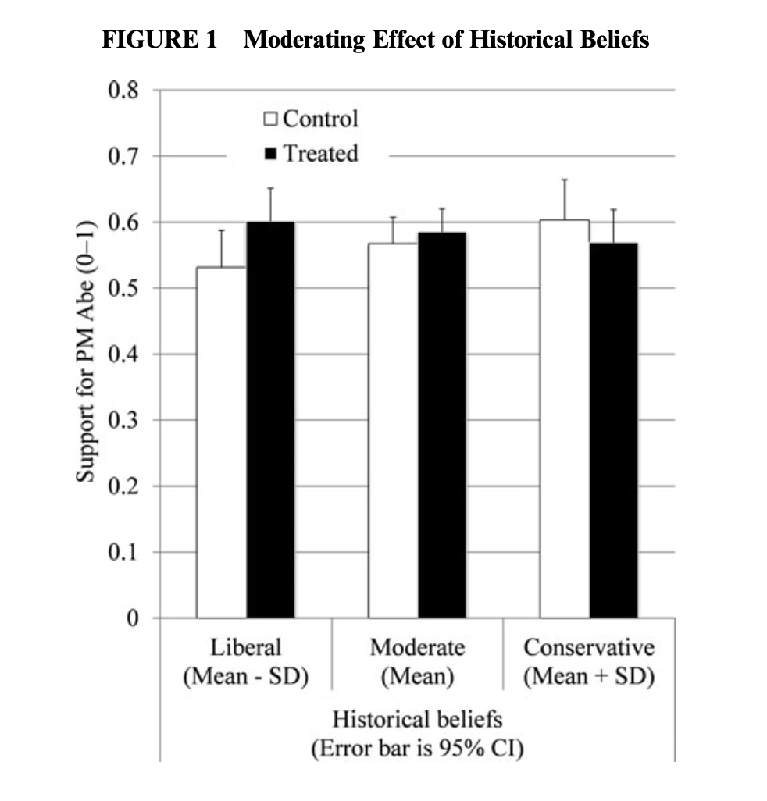
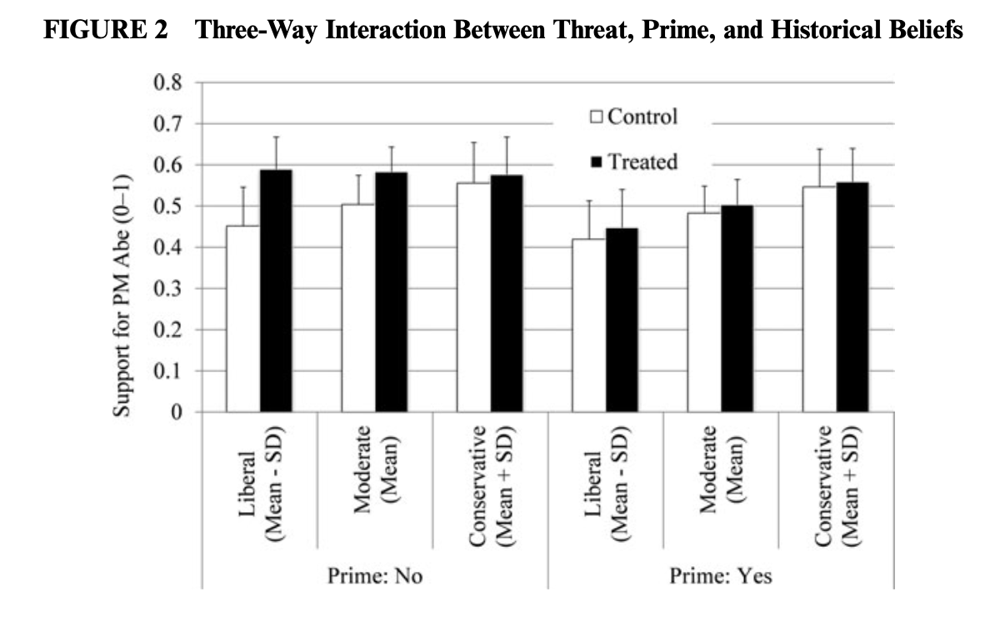

```{r setup, include=FALSE}
# to use FontAwesome
#htmltools::tagList(rmarkdown::html_dependency_font_awesome())
library(fs)
library(fontawesome)
# library(magick)  
library(ggplot2)
library(tidyverse)

#setwd("/Users/bson3/Documents/GitHub/textvulture.github.io/")
#setwd("/Users/kalka/Documents/GitHub/textvulture.github.io/")

```

class: inverse, top, right
background-image: url(https://www.belfercenter.org/sites/default/files/styles/featured_image_1280x515_/public/images/publication/feature/senkaku_islands_dispute_by_al_jazeera_english_8.jpg?h=db7fce1d&itok=yfUI1t9z)
background-size: cover

# .Large[Conflict in Asia (GLOA400-001)]
---

class: inverse, center, middle
background-color: #d64161

# .huge[Globalization and Security]

--

# Does globalization make the world peaceful?

---

background-image: url(http://media3.giphy.com/media/26tOW2rFXxIT3BPeE/giphy.gif)
background-size: contain

---
class: inverse, center, middle
background-color: #d64161

# Could be .yellow[yes]: 'democratic' & 'capitalist' peace

--

# Could be .blue[no]: more connectivity, more disagreement

--

# What do data say?

---

# Global Data ('Correlates of War')

```{r echo=FALSE, fig.height=8, fig.width=18, message=FALSE, warning=FALSE, cache=TRUE}
# devtools::install_github("prio-data/priogrid")
# https://rforpoliticalscience.com/category/ucdp-prio/
# install.packages('peacesciencer')
# install.packages('states')

library(vdemdata)
library(reshape2)

df <- vdem %>%
  select(year, 
         COWcode,
         e_civil_war, 
         e_miinteco,
         e_regionpol_6C) %>%
  rename(civil.war = e_civil_war,
         war = e_miinteco,
         region = e_regionpol_6C)


# 6=Asia

df %>%
  group_by(year) %>%
  add_count() -> df

df %>%
  filter(!is.na(civil.war)) %>%
  group_by(year) %>%
  mutate(mean.civilwar = sum(civil.war)/n) -> df

df %>%
  filter(!is.na(war)) %>%
  group_by(year) %>%
  mutate(mean.war = sum(war)/n) -> df

df %>%
  ggplot(aes(x=year, alpha=0.5)) +
  geom_line(aes(y=mean.war, color='a'), size=1.5, ) +
  geom_line(aes(y=mean.civilwar, color='b'), size=1.5, ) +
  labs(x = "Year",
       y = "Average War") + 
  theme(axis.text=element_text(size=20),
        axis.title=element_text(size=20),
        legend.title=element_text(size=20),
        legend.text=element_text(size=20)) +
        scale_color_manual(name = "War Types",
                           labels = c("Interstate War","Civil War"), 
                           values = c('a'='red', 'b'= 'blue')) +
  scale_alpha(guide = 'none')


```

---


# Asia-Pacific Data ('Correlates of War')

--

```{r echo=FALSE, fig.height=8, fig.width=18, message=FALSE, warning=FALSE, cache=TRUE}
# devtools::install_github("prio-data/priogrid")
# https://rforpoliticalscience.com/category/ucdp-prio/
# install.packages('peacesciencer')
# install.packages('states')

library(vdemdata)
library(reshape2)

df <- vdem %>%
  select(year, 
         COWcode,
         e_civil_war, 
         e_miinteco,
         e_regionpol_6C) %>%
  rename(civil.war = e_civil_war,
         war = e_miinteco,
         region = e_regionpol_6C)


# 6=Asia

df %>%
  group_by(year) %>%
  add_count() -> df

df %>%
  filter(!is.na(civil.war)) %>%
  filter(region==6) %>%
  group_by(year) %>%
  mutate(mean.civilwar = sum(civil.war)/n) -> df

df %>%
  filter(!is.na(war)) %>%
  group_by(year) %>%
  mutate(mean.war = sum(war)/n) -> df

df %>%
  ggplot(aes(x=year, alpha=0.5)) +
  geom_line(aes(y=mean.war, color='a'), size=1.5, ) +
  geom_line(aes(y=mean.civilwar, color='b'), size=1.5, ) +
  labs(x = "Year",
       y = "Average War") + 
  theme(axis.text=element_text(size=20),
        axis.title=element_text(size=20),
        legend.title=element_text(size=20),
        legend.text=element_text(size=20)) +
        scale_color_manual(name = "War Types",
                           labels = c("Interstate War","Civil War"), 
                           values = c('a'='red', 'b'= 'blue')) +
  scale_alpha(guide = 'none')


```

---
class: inverse, center, middle
background-color: black

# .huge[Potential Threats?]
---

class: inverse, left, top
background-image: url(https://i.insider.com/545be442ecad046f71028e5a?width=840&format=jpeg)

# .red[Threat #1: Territorial/Border Disputes]

---

class: inverse, left, top
background-image: url(https://www.ctvnews.ca/polopoly_fs/1.5578436.1631488969!/httpImage/image.jpg_gen/derivatives/landscape_1020/image.jpg)
background-size: cover

# .red[Threat #2: His Regime]


---

class: inverse, middle, center
background-color: 06363B

# We actually know very little about NK. 

--

# But much more than before.

--

# Mostly through defectors as well as Chinese traders.

---

# '.green[Exit Polls]' (Change et al. 2009): the setting

--

## `r fa("glasses")` &nbsp; A rare glimpse into North Korean society/people

--

## `r fa("question-circle")` &nbsp; "Are NK people .red[angry] at their government?"

## `r fa("hand-rock")` &nbsp; Any sign of mass-mobilization or .red[collective action]?

--

## `r fa("microphone-alt")` &nbsp; Interview .red[1,300+] NK defectors (used only 700)

## `r fa("smile-wink")` &nbsp; A very biased sample

---


# '.green[Exit Polls]' (Change et al. 2009): The findings ('satisfaction')

.center[

]


---
class: inverse
background-color: #0F0639

# '.green[Exit Polls]' (Change et al. 2009): The findings ('satisfaction')

--

## - generally better informed about the outside world than we thought.

  - .Large[the balloons .red[`r fa("fly")`] &nbsp; ain't working]

--

## - citizens understand that the regime does not care.

--

## - regime ratings were generally low; people are dissatisfied.

--

# Then why .red[no] revolution???

---

# One big factor: .red[Fear] (and propaganda)

.pull-left[
.center[
```{r echo=FALSE, out.width='80%'}
knitr::include_graphics('https://i.pinimg.com/236x/c3/14/46/c31446ffb3201b08c6141058a281e6af--korean-painting-propaganda-art.jpg')
```
]
]

.pull-right[
.center[
```{r echo=FALSE, out.width='80%'}
knitr::include_graphics('https://i.pinimg.com/originals/32/01/cd/3201cdab29192ce5ed941b2d6857cd1e.jpg')
```
]
]

---

# 'The Authoritarian Toolbox' (Byman & Lind 2010)

.pull-left[
# Against People (.red[revolution])

### - restrictive social policies

### - manipulation of ideas & info

### - use of force
]

--

.pull-right[
# Against Elites (.red[coup])

### - co-optation

### - manipulation of foreign govt's

### - institutional coup-proofing

]

---

class: inverse, center, middle
background-color: red

# .huge[Now, territorial disputes]

--

# South China Sea & Senkaku/Diaoyu Islands

---

class: top, right

background-image: url(https://cms.qz.com/wp-content/uploads/2016/06/spratly-paracel-scarborough-v3.png?quality=75&strip=all&w=1880&h=1058&crop=1)
background-size: contain

# South China Sea Disputes

---
# Mischief Reef, Spratly Islands in 2012 (L) and 2020 (R)

.pull-left[
```{r echo=FALSE, out.width='110%'}
knitr::include_graphics('https://i0.wp.com/amti.csis.org/wp-content/uploads/2018/02/mischief_jan24_2012_qb02_overview_28299305844_o-wm.jpg?zoom=2&w=592&h=453&ssl=1')
```
]

--

.pull-right[
```{r echo=FALSE, out.width='110%'}
knitr::include_graphics('https://i2.wp.com/amti.csis.org/wp-content/uploads/2018/02/Mischief_4_23_2020-webres-WM.jpg?zoom=2&w=785&h=607&ssl=1')
```
]
---
class: inverse, top, center
background-image: url(https://multimedia.scmp.com/south-china-sea-disputes-maps/assets/west_london_reef_afp.jpg)
background-size: contain

# West London Reef (Spratly Islands), 2010 (L) and 2015 (R)

---

class: top, right

background-image: url(https://cms.qz.com/wp-content/uploads/2016/06/spratly-paracel-scarborough-v3.png?quality=75&strip=all&w=1880&h=1058&crop=1)
background-size: contain

# South China Sea Disputes

---

# The Essence of the Disputes (De Castro 2020; Zhao 2020; Wiegand & Beuck 2020)

### general rule: 200 NM EEZ (UNCLOS) ⇒ limited claim to sovereignty: .red[China disputes]

--

.pull-left[
# .red[China]

### - history; 'official takeover' of Parcels (1974) and Mischief Reef (1995)

### - .green[strategic ambiguity -> clarity]

### - economic sanctions

]

--

.pull-right[
# .orange[The Philippines]

### - domestic laws 

### - .green[multilateral, institutional solutions]?

  - .Large[ASEAN; PCA]

### - Duterte ambivalence/appeasement 
]

---

class: inverse, center, middle
background-color: #145A32

# .huge[Senkaku/Diaoyu Disute]

---

background-color: black
background-image: url(https://apjjf.org/data/lee_photo_A.jpg)
background-size: contain

---
class: inverse, center, middle

# Chinese assertiveness is not unique to the case, <br> but what about .green[Japan]?

---

## Why increased support for the PM Abe during disputes?

: .Large[rally 'round the flag] vs. .red[.Large[reactive liberal]]

--

.pull-left[
```{r echo=FALSE, out.width='80%'}

```
]

--

.pull-right[
```{r echo=F, out.width="800px"}

```
]


