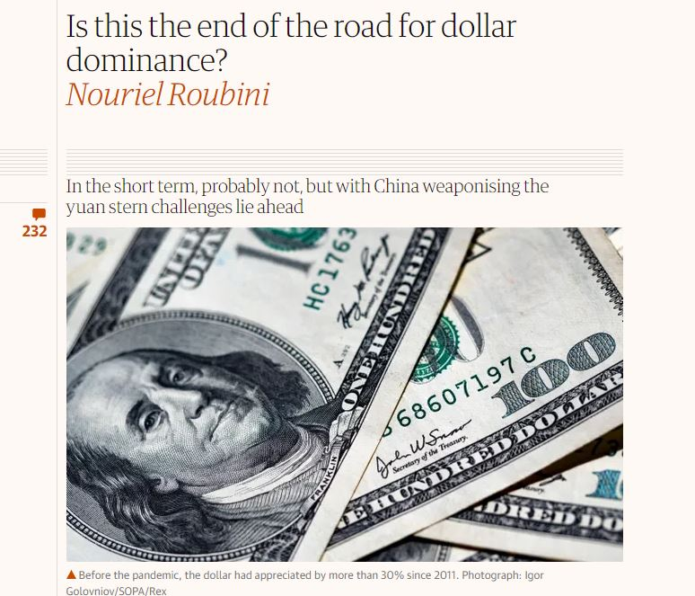

```{r setup, include=FALSE}
# to use FontAwesome
#htmltools::tagList(rmarkdown::html_dependency_font_awesome())
library(fs)
library(fontawesome)
# library(magick)  
library(ggplot2)
library(tidyverse)
knitr::opts_chunk$set(warning = FALSE, message = FALSE, error=F, echo=F)
options(htmltools.preserve.raw = FALSE)

```

class: top, left, middle
background-image: url(https://media0.giphy.com/media/cJFQJzZxFMhONxDTnt/200w.gif?cid=6c09b952ib6bxzy74li8lofynkhfmhqaue0rgolki8u9afeg&ep=v1_gifs_search&rid=200w.gif&ct=g)
background-size: 60%
background-position: right

# .huge[.Blue[**Global <br> Finance**]] <br><br> GLOA 610

---

class: inverse
background-color: black
background-image: url(https://encrypted-tbn0.gstatic.com/images?q=tbn:ANd9GcSm8iyhqitY7a6JP3AyfNXCxPzZGc6GM4DvPA&usqp=CAU)
background-size: contain
background-position: right

## .Large[Three Areas of Global 'Finance']

--

## 1) Currency Exchanges (exchange rates) <br>: $6 tn .yellow[per day]
--

## 2) Debt ($100 tn)
--

## 3) Other types of money flow <br> (e.g., remittances: $6 bn)


---
class: inverse, bottom, right
background-color: #37145A
background-image: url(https://media.giphy.com/media/3oz8xMrLEYDnoHLbCE/giphy.gif)
background-size: contain

# .yellow[.Huge[First, Exchange Rates]]

---
class: inverse
background-color: #37145A
background-image: url(https://cdn.britannica.com/13/145313-050-852A6F13/Exchange-rates-Suvarnabhumi-International-Airport-Thai-Bangkok.jpg)
background-position: right
background-size: 30%

# **Exchange rates** <br> = value of a currency compared to another's <br> = the .red[price] of a currency

--

## 1. .yellow[nominal] exchange rates 

- .large[need to know when travel abroad `r fa("plane")` : a-/depreciate)]
- .large[instantaneously available]

--

## 2. .red[real] exchange rates 

- .large[nominal] ** $\times$ ** .large[inflation rates: under/overvalued]
- .large[estimates]
- .large[considered an indicator .red[competitiveness] ]

---

# .Large[But, what competitiveness?]

--

# : the .red[price] competitiveness of .green[tradables] 

--

# .red[under]valuation: good for exports ('beggar-thy-neighbor')

--

.pull-left[
.content-box-yellow[.Large[
## importing a BMW `r fa("car")`
- `r fa("euro-sign")` 1 = `r fa("dollar-sign")` 1
- `r fa("euro-sign")` 50k ⇒ `r fa("dollar-sign")` 50k 
- amount paid to BMW: `r fa("euro-sign")` 50k
]
]
]

--

.pull-right[
.content-box-red[.Large[
## importing a BMW `r fa("car")`
- `r fa("euro-sign")` .red[2] = `r fa("dollar-sign")` 1
- `r fa("euro-sign")` 50k ⇒ `r fa("dollar-sign")` 25k: sales `r fa("turn-up")` 
- amount paid to BMW: `r fa("euro-sign")` .red[50k]
- *effect on US automakers?*
]
]
]

---
class: inverse
background-color: #d64161
background-image: url(https://raw.githubusercontent.com/textvulture/textvulture.github.io/master/images/background_leftEmpty2.jpg)
background-size: 140%

# .huge[So undervaluation is .yellow[all] good?]

--

## - serious welfare/distributional effects

--

## - not a universal national strategy (cf. 'currency manipulator')

## - .orange[interest groups] would lobby for undervaluation (.Green[sometimes])

--
# Broz and Werfel (2014); Steinberg and Shih (2012)


---

class: inverse, center, middle
background-color: #37145A
background-image: url(https://raw.githubusercontent.com/textvulture/textvulture.github.io/master/images/forestBackground.jpg)
background-size: 100%

# .huge[Let's talk about Debt]

## And how it is related to development

---


class: inverse, center, middle
background-color: red

# .Huge[Is Debt = Doom `r fa("skull")`?]

--

# B/C, foreign debt = losing independence?

--

# OMG, I remember we owe China *a lot* ! 

---

# A quick .Yellow[cut-away]: The Story of American Debt

--
.pull-left[
.center[
```{r, echo=F, out.width='95%'}
knitr::include_graphics('https://cdn.howmuch.net/articles/Foreign-Curency-Draft9-4ddb.png')
```
]
]

--
.pull-right[
.center[
```{r, echo=F, out.width='95%'}
knitr::include_graphics('https://wolfstreet.com/wp-content/uploads/2018/10/US-Treasury-holdings-TIC-pie-2018-08.png')
```
]
]


---
# Aren't people still say the US `r fa("dollar-sign", fill='green')` dominance is ending?

--

.pull-left[
```{r, echo=F}

```
]

--

.pull-right[
```{r, out.width='60%', fig.align='center'}
knitr::include_graphics('https://pup-assets.imgix.net/onix/images/9780691168524.jpg')
```
]

---
class: inverse
background-color: #37145A

# .Large[**But aren't .red[most] debts still bad?**]

.pull-left[


## - No: In particular, .red[sovereign debt]: sources of .green[development fund]

## - .red[Too much] sovereign debt spells trouble though (i.e., 'original sin')

## - the more you borrow, the harder it becomes to borrow (.yellow[credit rating])
]

--

.pull-right[
# Example: Moody's
.center[
```{r, echo=F, dpi=900}
knitr::include_graphics('https://saylordotorg.github.io/text_personal-finance/section_20/2477783b832fc7bb254af9b421701e9a.jpg')
```
]
]

---

class: inverse, middle
background-image: url(https://www.glabarre.com/item_images/5k%20us%20bond.jpg)
background-size: contain
background-position: right
background-color: black

--

# .huge[**How does .Green[bond] work?**] 

--

# .Blue[**.green[Domestic] vs. Foreign currency denomination?**]

--

# .orange[**Ballard-Rosa, Mosely, and Wellhausen (2021)**]

---
class: inverse, left, bottom
background-image: url(https://miro.medium.com/max/1400/1*Z-htNgpOFMVwdQHWLMrZ2Q.gif)
background-size: contain

# .Large[Sometimes you just cannot repay the debt.]

--

# You need a bailout: how does that work?

--
# .yellow[.Large[Schneider and Tobin (2020)]]

---

class: inverse, right
background-image: url(https://content3.jdmagicbox.com/comp/hyderabad/f6/040pxx40.xx40.140124131631.x9f6/catalogue/star-global-currency-exchange-pvt-ltd-jubilee-hills-hyderabad-foreign-exchange-agents-49enny0.jpg?clr=3f273f)
background-size: contain
background-position: left
background-color: black

#.huge[**Remmitances**]

--

## `r fa("scale-balanced", fill="yellow")` Debatable if it helps development

--

### financing vs. rent-seeking

--

## `r fa("check-to-slot", fill="red")` But is there any other effect?

--

### Tertytchnaya et al. (2018)


