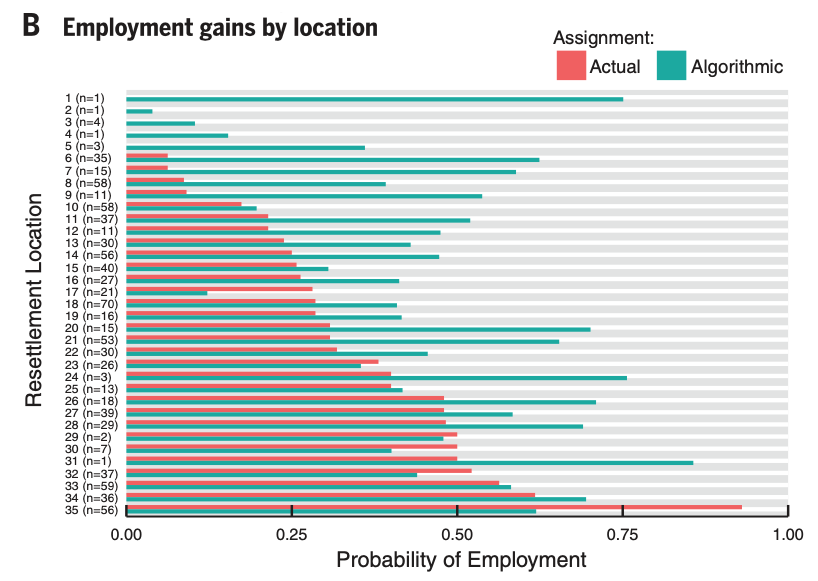

```{r setup, include=FALSE}
# to use FontAwesome
#htmltools::tagList(rmarkdown::html_dependency_font_awesome())
library(fs)
library(fontawesome)
# library(magick)  
library(ggplot2)
knitr::opts_chunk$set(warning = FALSE, message = FALSE, error=F, echo=F)
options(htmltools.preserve.raw = FALSE)
```

class: inverse, center, top
background-image: url(https://news.miami.edu/_assets/images-stories/2020/05/migrationsymp_hero_940x529.jpg)
background-size: contain

# .huge[**Immigration**, GLOA 610] <br> <br>


```{r message=FALSE, echo=FALSE, warning=FALSE, results="asis", fig.width=16, fig.height=7, cache=T}

library(tidyverse)
library(WDI)
library(ggplot2)


var = c('m.stock' = "SM.POP.TOTL",
        'm.stock.per' = 'SM.POP.TOTL.ZS',
        'refugee.send' = 'SM.POP.REFG.OR',
        'refugee.arrive' = 'SM.POP.REFG', 
        'GDPpc' = 'NY.GDP.PCAP.KD')

wdi <- WDI(indicator=var,
           start=1985,
           country = 'all',
           end=2020,
           extra=TRUE)
```

---

<div class="full-width-tinted"><br>
  <h1> .large[Immigration 'stock' (% population) trend ] </h1> 
</div><br><br> 

```{r message=FALSE, echo=FALSE, warning=FALSE, results="asis", fig.width=16, fig.height=7, cache=T}

wdi %>% 
  drop_na(GDPpc) %>%
  drop_na(m.stock.per) %>%
  mutate(developed = 
           case_when(GDPpc > 10000 ~ "developed",
                     GDPpc < 10000 ~ "underdeveloped"
                     )) %>%
  ggplot(aes(y=m.stock.per, 
             x=year,
             color=developed)) +
  geom_smooth() +
  geom_jitter(alpha=0.15, 
              width = 0.7,
              size=5) +
  labs(y="Migrant Stock % of population",
       x="Year") +
  theme_minimal() +
  theme(legend.title = element_text(size=0),
        legend.text = element_text(size=25),
        axis.text=element_text(size=25),
        axis.title=element_text(size=25))

```     
---

<div class="full-width-tinted"><br>
  <h1> .large[Refugees by Origins] </h1> 
</div><br><br> 

```{r message=FALSE, echo=FALSE, warning=FALSE, results="asis", fig.width=16, fig.height=7, cache=T}

wdi %>% 
  drop_na(GDPpc) %>%
  drop_na(refugee.send) %>%
  mutate(developed = 
           case_when(GDPpc > 10000 ~ "developed",
                     GDPpc < 10000 ~ "underdeveloped"
                     )) %>%
  mutate(log.ref1 = log(refugee.send)) %>%
  ggplot(aes(y=log.ref1, 
             x=year,
             color=developed)) +
  geom_smooth() +
  geom_point(alhpa=0.2,
             size=2) +
  labs(y="Refugees by origins, log-scale",
       x="Year") +
  theme_minimal() +
  theme(legend.title = element_text(size=0),
        legend.text = element_text(size=25),
        axis.text=element_text(size=25),
        axis.title=element_text(size=25))

```     

---

<div class="full-width-tinted"><br>
  <h1> .large[Refugees by Destinations] </h1> 
</div><br><br> 

```{r message=FALSE, echo=FALSE, warning=FALSE, results="asis", fig.width=16, fig.height=7, cache=T}

wdi %>% 
  drop_na(GDPpc) %>%
  drop_na(refugee.arrive) %>%
  mutate(developed = 
           case_when(GDPpc > 10000 ~ "developed",
                     GDPpc < 10000 ~ "underdeveloped"
                     )) %>%
  mutate(log.ref2 = log(refugee.arrive)) %>%
  ggplot(aes(y=log.ref2, 
             x=year,
             color=developed)) +
  geom_smooth() +
  geom_point(alhpa=0.2,
             size=2) +
  labs(y="Refugees by destinations, log-scale",
       x="Year") +
  theme_minimal() +
  theme(legend.title = element_text(size=0),
        legend.text = element_text(size=25),
        axis.text=element_text(size=25),
        axis.title=element_text(size=25))

```   

---
class: inverse, middle
background-image: url(https://thumbs.gfycat.com/CrispBabyishAfricanparadiseflycatcher-max-1mb.gif)
background-color: black
background-position: right
background-size: contain


# Where do .red[immigrants] end up? 

### What do they consider when they choose their new home `r fa("home", fill='yellow')`? 

--

# - .yellow[Economic Interests?]

--

# - .green[Affinity?]

---
background-image: url(https://github.com/textvulture/textvulture.github.io/blob/master/images/Fitzgerald2014.png?raw=true)
background-position: right

# .Large[Fitzgerald et al. (2014)]
## - The .bluey[conditional] effect of <br> economic incentives
## - Political factors

---
class: inverse
background-color: black
background-image: url(https://c.tenor.com/Cw777VnGhWwAAAAC/slamming-door-shutting-door.gif)
background-position: right
background-size: contain

# .Large[What do .red[hosts] think?] 

## When do they want to shut the door? `r fa("door-open")`

--

# - .yellow[Economic Interests?]

# - .green[Affinity?]

--

# Hainmueller et al. (2015)

---
class: inverse, right, bottom
background-image: url(https://www.stashmedia.tv/wp-content/uploads/Screenshot-2017-12-19-08.20.55-640x359.png)
background-size: contain

# .Large[What about .red[Refugees]?]

# When are hosts reluctant? .yellow[Contact Theory]?

--

# **Hangartner et al. (2018)**

---

background-image: url(https://github.com/textvulture/textvulture.github.io/blob/master/images/Alrabab2021.png?raw=true)
background-position: right
background-size: contain
class: middle

# **Alrababa'h et al. (2021)**

--

# - non-western hosts
# - economy `r fa("bell-slash", fill='red')`

---
class: inverse
background-image: url(https://cdn.dribbble.com/users/435189/screenshots/3667850/refugee-assimilate.gif)
background-position: right
background-color: black
background-size: 50%

# .Large[What can be done <br> for .yellow[integration]?] </h1> 

--

# Bansak et al. (2018)

---

# Banksak et al. (2018)

## .red[`r fa("robot")`] &nbsp; *what could've happened if the algorithms were used ...*

.pull-left[
.center[
.Large[USA]

]

]

.pull-right[
.center[
.Large[Switzerland]

]


]

---

# Image References

- front page: https://news.miami.edu/_assets/images-stories/2020/05/migrationsymp_hero_940x529.jpg

- https://media1.giphy.com/media/lpt5YA1gY68yhJjGpm/giphy.gif

- https://c.tenor.com/KOlhCrT47R0AAAAC/youre-stealing-from-us-stealing.gif

- https://cdn.dribbble.com/users/435189/screenshots/3667850/refugee-assimilate.gif
