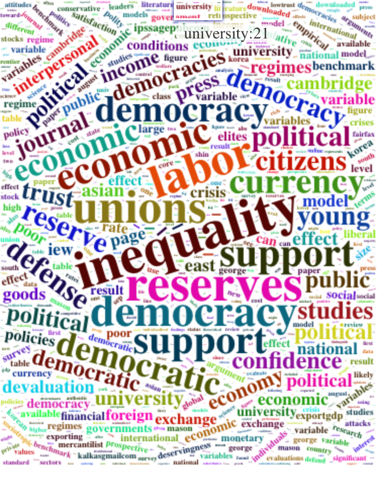

```{r setup, include=FALSE}
# to use FontAwesome
htmltools::tagList(rmarkdown::html_dependency_font_awesome())
library(fs)
library(fontawesome)
# library(magick)  
```

class: inverse, center, top
background-image: url(https://hive.rochesterregional.org/-/media/how-to-properly-wear-a-mask-copy.jpg?h=1056&w=1290&la=en&hash=B547AA40883BD31A0D1956102204C575632B8274&hash=B547AA40883BD31A0D1956102204C575632B8274)
background-size: contain
background-color: white

---

class: inverse, center, middle

# .HUGE[.yellow[Welcome to <br> GLOA 610]]

---

class: inverse, middle
background-image: url(https://images.unsplash.com/photo-1459015508864-5fa6de29b58a?ixlib=rb-1.2.1&ixid=MnwxMjA3fDB8MHxzZWFyY2h8MTZ8fGZvcmVzdCUyMGRhd258ZW58MHx8MHx8&w=1000&q=80)
background-size: cover

# Really glad to see you all today.

--

# We've suffered .red[a lot] and I really hope that we're turning the corner. 

--

# In the mean time, let's .yellowp[strictly] adhere to the safety rules: e.g., relentless and robust masking .yellow[`r fa("head-side-mask")`].

---
# Introduction: Byunghwan Son 

.pull-left[


```{r, echo=F, out.width="350px" }
 
```
]

--

.pull-right[

.large[
`r fa("building-columns")` George Mason University <br>
|- Associate Prof. of Global Affairs

`r fa("graduation-cap")` PhD in political science (2013) <br>
|- University of Missouri-Columbia
  
`r fa("chalkboard-user")`  Research/Teaching   
|-   .red[politics of global finance]      <!-- the 'four space' rule --><br>
|-   democratic backsliding  <br>
|-   public opinion; big data; social media <br>
|-   Globalization in Asia   <br>

`r fa("address-book")` Contact  
|-   <i class="fas fa-envelope"></i> <bson3@gmu.edu>   
|-   <i class="fas fa-home"></i> [ben-son.netlify.app](ben-son.netlify.app)  
]
]

---
background-color: black

<center>

```{r, echo=F, out.width="850px", center }
 
```

</center>

---
class: inverse
background-color: #50394c
background-image: url(https://img.wallpapersafari.com/desktop/1024/576/56/91/p7HYat.jpg)
background-size: cover

# We will talk about the nitty-gritties (i.e., the .red[syllabus] <i class="fas fa-file-alt"></i>) of the class pretty soon.

--

## .orange[But] some premises for the class first:

--

### - the world is complex 

--

### - things are often good .red[and] bad at the same time

--

### - a .red[single] perspective wouldn't fully explain anything 

--

### - those who .red[don't] accept the complexities would resort to ...

---

background-image: url(https://d21rhj7n383afu.cloudfront.net/washpost-production/The_Washington_Post/20210107/5ff6767d4cedfd00015fab72/5ff67838c9e77c0007a14669_1450955028646-chsuqu_t_1609988154811_640_360_400.gif)
background-size: cover
class: right, top, inverse

# .yellow[... something like this]

---

class: inverse
background-color: #4040a1
background-image: url(https://img.wallpapersafari.com/desktop/1024/576/56/91/p7HYat.jpg)
background-size: cover

# .center[.large[.yellow[Neoliberalism]]]

--

## .orange[M]ost people use it when talking about economic globalization.

## .orange[I]t's an important & useful concept.

--

## .orange[B]ut it can be .red[incorrect] and lack conceptual clarity or rigor when it used as a blanket term.

--

.blockquote[ 
# *'.yellow[something] very evil about capitalism and market economy'* 
]

---

class: inverse
background-color: black

# So when someone says:

.blockquote[.huge["*People of* country X *are trapped in poverty, which has been perpetuated by .yellow[neoliberalism*]"] ]

--

# `r fa("hand-point-right")` not wrong, but it *also* sounds like: 

--

## 'There's this .red[evil organization] out there working on an elaborate global plot *against* the poor and *for* the rich.'
---


class: inverse, top
background-image: url(https://c.tenor.com/SA4YQic_1QIAAAAd/austin-powers-dr-evil.gif)
background-size: contain
background-color: black


<br>
# .huge[There isn't one ... not that I know of.]
<br>
<br>
<br>
<br>


--

# .huge[It's .red[lazy] science at best.]
---

class: inverse
background-image: url(https://preventionlane.org/wp-content/uploads/2015/02/blackboard.jpg)

<div class="full-width-tinted"><br>
  <h1> So please avoid using the blanket term 'neoliberalism' .yellow[in this class] (but def. do in *other* classes)
 </h1> 
</div><br><br> 

--

## - For conceptual accuracy and intellectual rigor 

### (for training purposes; hence *only* in this class).

--

## - Instead, be specific: 

### isn't it 'privatization,' 'deregulation,' 'trade liberalization,' or 'austerity' that you .orange[actually] want to talk about when you say something along the line of '*the neoliberal reforms exacerbated the situation*'?

--

## - Or, why not just call it .red[capitalism] or .green[market economy]?

---

class: inverse, middle
background-color: black
background-image: url(https://pbs.twimg.com/media/FaZFQ9QUsAAxo0v?format=jpg&name=large)
background-position: right
background-size: contain

# .large[.yellow[*Oh, one more thing.*]]

--

# This ain't an .red[econ] class.

# I am not an economist. 

# Neither are you.

### Econ literature makes only a minority <br> (though significant) in our reading


---
class: inverse
background-image: url(https://preventionlane.org/wp-content/uploads/2015/02/blackboard.jpg)

<div class="full-width-tinted"><br>
  <h1> .huge[We want to accomplish today:] </h1> 
</div><br><br> 

# 1. overview of the syllabus

# 2. setting up the presentation schedule

# 3. brief review of social science methods.

---

### Image Sources
.tiny[
- https://hive.rochesterregional.org/-/media/how-to-properly-wear-a-mask-copy.jpg?h=1056&w=1290&la=en&hash=B547AA40883BD31A0D1956102204C575632B8274&hash=B547AA40883BD31A0D1956102204C575632B8274

- https://images.unsplash.com/photo-1459015508864-5fa6de29b58a?ixlib=rb-1.2.1&ixid=MnwxMjA3fDB8MHxzZWFyY2h8MTZ8fGZvcmVzdCUyMGRhd258ZW58MHx8MHx8&w=1000&q=80

- https://img.wallpapersafari.com/desktop/1024/576/56/91/p7HYat.jpg

- https://media.giphy.com/media/l0EwYzW7Tm8Xkow9O/giphy-downsized-large.gif?cid=ecf05e47e41ywxmvd7fi8jnn5mnu8t10v89stcxbg7ut3brw&rid=giphy-downsized-large.gif&ct=g

- https://preventionlane.org/wp-content/uploads/2015/02/blackboard.jpg

- https://pbs.twimg.com/media/FaZFQ9QUsAAxo0v?format=jpg&name=large
]
