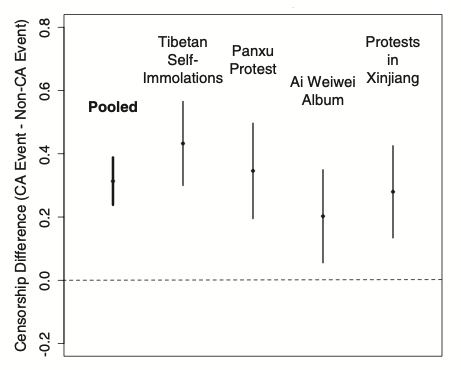
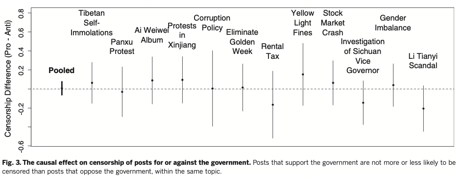

```{r setup, include=FALSE}
# to use FontAwesome
#htmltools::tagList(rmarkdown::html_dependency_font_awesome())
library(fs)
library(fontawesome)
# library(magick)  
library(ggplot2)

```

class: inverse, bottom, right
background-image: url(https://www.bloomberg.com/graphics/2019-hong-kong-protesters-umbrellas/img/2019-hong-kong-protesters-umbrellas-facebook.png)
background-size: contain
background-position: left
background-color: black

# .huge[**Political Freedom in Asia**]

# GLOA 615

---
class: inverse
background-image: url(https://c.tenor.com/nBu63g7QuK0AAAAC/amy-poehler-high-five.gif)
background-size: cover

# Political Globalization: more .yellow[political freedom]

---

class: inverse, center, middle
background-image: url(https://cdn2.opendemocracy.net/media/images/Tiphagne_VOcI8YM.width-800.jpg)
background-size: cover

# .Huge[**What does political freedom look like in Asia?**]


---

# Political Freedom (freedom of speech, V-Dem data)

--
```{r, echo=F, message=F, error=F, warning=F, cache=T, fig.width=15, fig.height=7}


library(vdem) #remotes::install_github("xmarquez/vdem")
library(tidyverse)


df <- extract_vdem(
  include_sd = TRUE,
  name_pattern = "v2x_freexp_altinf"
)

df %>% 
  filter(year>1970) %>%
  rename(country_name = vdem_country_name) %>%
  mutate(Asia = 
           case_when(extended_continent == "Asia" ~ "Asia",
                     extended_continent != "Asia" ~ "Rest"),
         selected = 
           case_when(country_name == "China" ~ "China",
                     country_name == "Japan" ~ "Japan",
                     country_name == "South Korea" ~ "S.Korea",
                     country_name == "Indonesia" ~ "Indonesia",
                     country_name == "India" ~ "India",
                     country_name == "Vietnam" ~ "Vietnam")) ->   df2


ggplot(data = df2,
       aes(x=year,
             y=v2x_freexp_altinf)) + 
  theme_minimal() +
  geom_line(data = df2 %>% filter(!is.na(selected)),
            aes(color=country_name,
                size=1.2,
                alpha=1/3)) +
  geom_label(data = df2 %>% filter(!is.na(selected)) %>% 
               filter(year==1987),
             aes(label = country_name, 
                 color = country_name)) +
  geom_smooth(data = df2 %>% filter(Asia == "Rest"),
              aes(x=year,
                  y=v2x_freexp_altinf),
              color="red",
              alpha=1/2,
              linetype="dashed") +
  geom_smooth(data = df2 %>% filter(Asia == "Asia"),
              aes(x=year,
                  y=v2x_freexp_altinf),
              color="brown",
              alpha=1/2,
              linetype="dashed"
              ) +
  labs(x = "year", y="Political Freedom (Vdem") +
  theme(legend.position = "none",
        axis.text=element_text(size=20),
        axis.title=element_text(size=20)) +
  annotate(geom="text", x=2002.5, y=0.7, 
           label="The Rest of the World", color="red") +
  annotate(geom="text", x=2005, y=0.45, 
           label="Asia", color="brown")

```


---
class: inverse, right, middle

<iframe src="https://freedomhouse.org/country/hong-kong/freedom-world/2022"></iframe>


--

# .Large[** But why is it <br> 'Partly Free'?**]

---
class: inverse
background-color: black

# Yuen & Cheng (2017)

.blockquote[
## "[Hong Kong] is ... a .yellow[liberal enclave] within authoritarian China. However [it] also has a semi-authoritarian system with strong state-corporatist elements, where the Chief Executive and half of the legislature are .red[not elected via universal suffrage], allowing both its authoritarian principal in Beijing and local elites to wield immense power." (p. 614)
]

--

## .red[`r fa("face-smile-wink")`] traditional tactic: 'tolerance' [elite cohesion + counter-protest + court]
---

background-image: url(https://www.reuters.com/investigates/special-report/assets/hongkong-protests-extradition-narrative/RTS2ICNT.jpg?v=134011231219)
class: inverse

# .huge[**1.Extradition Bill (& abductions)**]

---

class: inverse
background-image: url('images/hk-election.png')

# .huge[.red[**2.Electoral Roll-back**]]
---
class: inverse
background-image: url(https://i.ytimg.com/vi/LJnt1FvCDbQ/maxresdefault.jpg)

# .huge[.yellow[**3.Brutal Repressions and Vicious Cycle**]]

---

class: inverse, middle
background-color: black

.center[
# .huge[Now, Online Censorship in .red[China]]
]

---
class: inverse, right
background-image: url(https://media0.giphy.com/media/i4jKn7itdV2Tvjzj6Y/giphy.gif)
background-size: contain

# globalization :: connectivity :: internet

--

# censorship :: de-globalization

---

# .orange[**How does it work? (King, Pan, and Roberts 2014)**]

--

### .Large[ `r fa("microscope")`: online experiments + participatory observation + interviews]

--

### .Large[ `r fa("table-cells-large")`: the .green[types] of posts focused on]


.Large[
|                 	| .red[non-collective action] 	| .blue[collective action] 	|
|:---------------:	|:---------------------:	|:-----------------:	|
|  .red[pro-government] 	|           1           	|         2         	|
| .blue[anti-government] 	|           3           	|         4         	|
]

--

# - which one is most likely censored?

---

# The Result (Figure 2)

.center[
```{r, echo=FALSE}

```
]

---

# The Result (Figure 3)

.center[
```{r, echo=FALSE, out.width='180%'}

```
]

---
class: inverse
background-color: black
background-image: url(https://preventionlane.org/wp-content/uploads/2015/02/blackboard.jpg)

# [Finding 1]

# : The authorities are worried about '.yellow[collective action]' contents

# [Finding 2]

# : Not much worried about .yellow[anti-government] contents

--

# `r fa("circle-question", fill="green")` But wouldn't the censorship be too obvious?

--

# : CCP employs '.green[distraction]' tactics

---
class: inverse
background-image: url(https://ichef.bbci.co.uk/news/976/cpsprodpb/AA63/production/_121091634_china_nationalist_weibo_influencer_illustration_1_v2.jpg)
background-size: contain

# .huge[**50 Cent Party and *ziganwu***]

