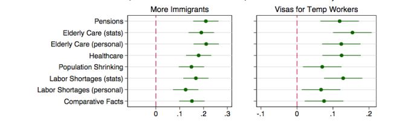

```{r setup, include=FALSE}
# to use FontAwesome
#htmltools::tagList(rmarkdown::html_dependency_font_awesome())
library(fs)
library(fontawesome)
# library(magick)  
library(ggplot2)
```

class: inverse, middle, center
background-image: url(https://shrm-res.cloudinary.com/image/upload/c_crop,h_253,w_450,x_0,y_0/w_auto:100,w_1200,q_35,f_auto/v1/Tools%20and%20Samples/18_1489_HupPage_Rullup_Immigration_sp1tkt.jpg)

# .Huge[**Immigration in Asia**] <br> GLOA 615 

---

<div class="full-width-tinted"><br>
  <h1> .large[Immigration 'stock' (% population) Global] </h1> 
</div><br><br> 


```{r, message=FALSE, echo=FALSE, warning=FALSE, results="asis", fig.width=16, fig.height=7, cache=T}
library(tidyverse)
library(WDI)
library(ggplot2)
library(ggThemeAssist)
library(ggrepel)


var = c('m.stock' = "SM.POP.TOTL",
        'm.stock.per' = 'SM.POP.TOTL.ZS',
        'refugee.send' = 'SM.POP.REFG.OR',
        'refugee.arrive' = 'SM.POP.REFG', 
        'GDPpc' = 'NY.GDP.PCAP.KD')

wdi <- WDI(indicator=var,
           start=1985,
           country = 'all',
           end=2020,
           extra=TRUE)

wdi %>% 
  filter(region != "Aggregates" ) %>%
  mutate(Asia = case_when(region == "East Asia & Pacific" ~ "E.Asia/Pac",
                          region == "South Asia" ~ "S.Asia",
                          region != "East Asia & Pacific" & region != "South Asia" ~ "Rest")) -> wdi2

wdi2 %>%
  ggplot(aes(y=m.stock.per, x=year)) +
  geom_point(data=wdi2 %>% filter(Asia=="E.Asia/Pac" | 
                                    Asia=="S.Asia" & m.stock>100000), 
             aes(color=Asia), alpha=0.5, size=6) +
  geom_point(data=wdi2 %>% filter(Asia=="Rest" & m.stock>100000),  alpha=0.1, size=2) +
  geom_label_repel(data=wdi2 %>% filter(Asia=="E.Asia/Pac" &
                                    m.stock.per>40 &
                                      m.stock>100000), 
                   aes(label=country), color='red', size=3, alpha=0.75) +
    geom_label_repel(data=wdi2 %>% filter(m.stock.per>75 &
                                      m.stock>100000), 
                   aes(label=country), color='black', size=3, alpha=0.75) +
    geom_label_repel(data=wdi2 %>% filter(country=="Korea, Rep." | country=="Japan"), 
                   aes(label=country), color='black', size=3, alpha=0.7) +
  labs(y="Migrant Stock % of population",
       x="Year") +
  theme_minimal() +
  theme(legend.position="bottom") +
  theme(axis.text = element_text(size = 20),
    legend.title = NULL)
```

---

<div class="full-width-tinted"><br>
  <h1> .large[Immigration 'stock' (% population) in Asia trend ] </h1> 
</div><br><br> 

```{r, message=FALSE, echo=FALSE, warning=FALSE, results="asis", fig.width=16, fig.height=7, cache=T}

wdi %>% 
#  drop_na(m.stock) %>%
  filter(country == "Korea, Rep." | 
           country == "China" |
           country == "Japan" |
           country == "India" | 
           country == "Indonesia" |
           country == "Malaysia" |
           country == "Bangladesh" |
           country == "Thailand" |
           country == "Philippines") %>%
  ggplot(aes(y=m.stock.per, x=year, color=country)) +
  geom_point(alpha=0.5, size=3) +
  geom_smooth(alpha=0.25, size=1) +
  labs(y="Migrant Stock % of population",
       x="Year") +
  theme_minimal() +
  theme(legend.text = element_text(size=25),
        axis.text=element_text(size=25),
        axis.title=element_text(size=25))


```

---

<div class="full-width-tinted"><br>
  <h1> .Large[Immigration and Economic Development] </h1> 
</div><br><br> 


```{r, message=FALSE, echo=FALSE, warning=FALSE, results="asis", fig.width=16, fig.height=7, cache=T}

wdi %>% 
#  drop_na(m.stock) %>%
  filter(country == "Korea, Rep." | 
           country == "China" |
           country == "Japan" |
           country == "India" | 
           country == "Indonesia" |
           country == "Malaysia" |
           country == "Bangladesh" |
           country == "Thailand" |
           country == "Philippines") %>%
  mutate(logGDP = log(GDPpc)) %>%
  ggplot(aes(y=m.stock.per, x=logGDP, color=country)) +
  geom_point(alpha=0.5, size=3) +
  geom_smooth(aes(color=NULL), alpha=0.25, size=0.5) +
  labs(y="Migrant Stock % of population",
       x="GDP per capita, log-scale") +
  theme_minimal() +
  theme(legend.text = element_text(size=25),
        axis.text=element_text(size=25),
        axis.title=element_text(size=25))
```

---

background-image: url(https://www.economist.com/sites/default/files/20170211_WOM969_0.png)
background-position: right
background-size: contain

# The .red[imbalance] <br> between <br> demand and supply


---
background-image: url(https://img.i-scmp.com/cdn-cgi/image/fit=contain,width=425,format=auto/sites/default/files/styles/768x768/public/images/methode/2018/08/28/7ce2731e-aa57-11e8-8796-d12ba807e6e9_1280x720_082342.JPG?itok=6OrbSrWl)
background-position: right
background-size: contain
class: middle, inverse


# Why are there <br> so .red[few] immigrants <br> in Taiwan, Japan, <BR> and South Korea?

# - don't they need people?

---

<div class="full-width-tinted"><br>
  <h1> .Large[The puzzle and the reality] </h1> 
</div><br><br> 

.pull-left[
# The .red[Puzzle]

.LARGE[
- economic sustainability
  - asset market
  - manufacturing sectors
- aging population

]
]

--

.pull-right[
# The .orange[reality]
.LARGE[
- strict rules on manual labor migrant workers
  - TW: 'population quality control' law
  - JP: 'Trainee' program
  - SK: Work permit system
]
]

---

class: inverse, right
background-image: url(https://miro.medium.com/max/1400/1*749_JgHFM-ahH172aPrGTg.gif)
background-size: contain


# Why so restrictive?

--

## - public antagonism

--

## - changing economic structure

--

## - weak social actors (Japan)

--

## - lack of .yellow[information]?

---

<div class="full-width-tinted"><br>
  <h1> .Large[Experiment: Japan] </h1> 
</div><br><br> 

--

# Japanese public opinions about immigration policies

### : .red[uninformed] vs. .blue[informed]

--

.center[]

---
<div class="full-width-tinted"><br>
  <h1> .Large[Asian Refugee .red[Origins]] </h1> 
</div><br><br> 


```{r, message=FALSE, echo=FALSE, warning=FALSE, results="asis", fig.width=16, fig.height=7, cache=T}

wdi %>% 
#  drop_na(m.stock) %>%
  filter(country == "Korea, Rep." | 
           country == "China" |
           country == "Japan" |
           country == "India" | 
           country == "Indonesia" |
           country == "Malaysia" |
           country == "Bangladesh" |
           country == "Thailand" |
           country == "Philippines") %>%
  mutate(logGDP = log(GDPpc)) %>%
  mutate(log.ref1 = log(refugee.send)) %>%
  ggplot(aes(y=log.ref1, x=year, color=country)) +
  geom_point(alpha=0.5, size=3) +
  geom_smooth(aes(color=NULL), alpha=0.25, size=0.5) +
  labs(y="Refugee, origins, log-scale",
       x="Year") +
  theme_minimal() +
  theme(legend.text = element_text(size=25),
        axis.text=element_text(size=25),
        axis.title=element_text(size=25))
```

---
<div class="full-width-tinted"><br>
  <h1> .Large[Asian Refugee .orange[Destinations]] </h1> 
</div><br><br> 
 

```{r, message=FALSE, echo=FALSE, warning=FALSE, results="asis", fig.width=16, fig.height=7, cache=T}

wdi %>% 
#  drop_na(m.stock) %>%
  filter(country == "Korea, Rep." | 
           country == "China" |
           country == "Japan" |
           country == "India" | 
           country == "Indonesia" |
           country == "Malaysia" |
           country == "Bangladesh" |
           country == "Thailand" |
           country == "Philippines") %>%
  mutate(log.ref2 = log(refugee.arrive)) %>%
  ggplot(aes(y=log.ref2, x=year, color=country)) +
  geom_point(alpha=0.5, size=3) +
  geom_smooth(aes(color=NULL), alpha=0.25, size=0.5) +
  labs(y="Refugee, arrive, log-scale",
       x="Year") +
  theme_minimal() +
  theme(legend.text = element_text(size=25),
        axis.text=element_text(size=25),
        axis.title=element_text(size=25))
```

