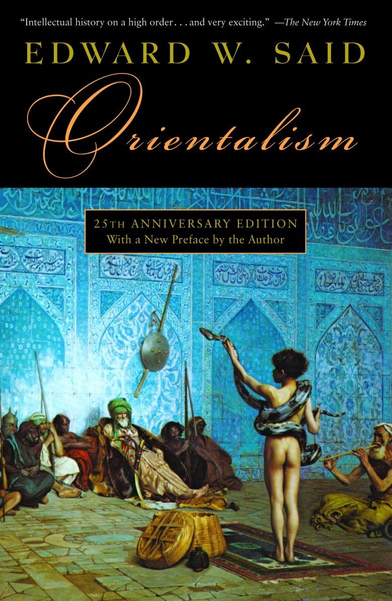

```{r setup, include=FALSE}
#htmltools::tagList(rmarkdown::html_dependency_font_awesome())
library(fs)
library(fontawesome)
# library(magick)  
library(ggplot2)
library(tidyverse)
```

---
class: inverse, right
background-image: url(https://penntoday.upenn.edu/sites/default/files/2020-09/iStock-521759159.jpg)

# .Huge[**Perspectives & Methods <br> GLOA 615**]

---

class: inverse
background-image: url(https://images.unsplash.com/photo-1578662996442-48f60103fc96?ixid=MnwxMjA3fDB8MHxzZWFyY2h8MXx8YmxhY2tib2FyZHxlbnwwfHwwfHw%3D&ixlib=rb-1.2.1&w=1000&q=80)
background-size: cover

# .Large[Today, we want to accomplish:]

# - A brief review of what globalization is  .green[`r fa("globe-asia")`]

# - A little bit of social science methods .yellow[`r fa("compass")`]

# - A very brief discussion of a perspective (orientalism) .red[`r fa("glasses")`]
---
class: inverse, center, middle
background-color: black

# .huge[So, what is globalization?]
---

background-image: url(https://media.giphy.com/media/QaMhVZVwOvDiw/giphy.gif)
background-color: black
background-size: contain
class: inverse, center, middle

--

# .yellow[No, seriously, what is it?]

---

class: inverse

# Do you remember .red[GLOA 101]? Was it ...

--

### - unstoppable, inevitable economic and technological progress?

--

### - Americanization / Westernization that provoked backlash?

--

### - A 'Globalist' elite conspiracy to take over the world?

--

.blockquote[.Large[
## Not really. It was:

- increasing / accelerating / deepening .yellow[connectivity]

- globality; globalization as a process
]
]

---
class: top
background-image: url(https://www.lboro.ac.uk/gawc/rb/images/rb439f2.jpg)
background-size: contain
background-position: middle
background-color: white

# .red[Connectivity]? 

---
# Globalization and History
## .center[.blue[Hyperglobalizers] vs. .red[Globalization Skeptics] ]

### globalization is: 

--

.pull-left[
.blockquote[ 
## .black[either the historically unprecedented development that started circa] .blue[1980] 
] 
]

--

.pull-right[
.blockquote[ 
## .black[or something that started as soon as the first time] .red[homo sapiens] .black[moved out of Central Africa.]
]
]
---
<div class="full-width-tinted"><br>
  <h1> .large[Our common understanding is ecclectic] </h1> 
</div><br><br> 

--

.right-column[

]

.left-column[

]

---
class: inverse, middle
background-color: #405d27

# So, .yellow[GLOA] definition of globalization:

## An increase and intensification of global and local connectedness that had been unfolding for a very long time but then changed its pace dramatically quite recently. 

---

<div class="full-width-tinted"><br>
  <h1> .large[Now, a little bit of social science methods] </h1> 
</div><br><br> 

.blockquote[
# King, Keohane & Verba (1994)
<br />   

### - .black[The goal of science is] .green[accumulation of knowledge]. 
### - .black[rigorous, unbiased, and public] .green[empirical] .black[research]
### - .black[qualitative] or .black[qualitative]
]

## Case Study: explorative (.red[deep] description) or cumulative (.red[!] selection bias)
---


<div class="full-width-tinted"><br>
  <h1> .Large[.center[In a .red[typical] research paper, you will see]] </h1> 
</div><br><br> 


<br>
<br>
.large[
|     RESEARCH      | WHAT IT DOES|
|     ---           |   :---:   |
|   *the nature*    | real-world event / accidents|
|                 | |
|   Research Question | Relevance; why bother?|
|   |    |
|       Literature | Others' work; Am I contributing?|
|                 | |
| Theory | Argument; A speculation about RQ|
|||
| Data / Test|Appropriate Design; unbiased & rigorous test|
|||
| Conclusion|Summary; implications|
]

---

class: inverse, right, top
background-color: #feb236
background-image: url(https://media.npr.org/assets/img/2018/09/19/pall-mall-page_wide-9060f56daa1a028babd34cb29b1a3e4cd0a870aa.jpg?s=1400)
background-size: contain
# .huge[Now, turning to Asia]

---

<div class="full-width-tinted"><br>
  <h1> .Large[.center[.yellow[Orientalism]: why do we talking about it?]] </h1> 
</div><br><br> 
<br>
<br>
<br>

--

# - epistemological problems

--

# - research design problem: selection bias 

--

# - interpretational/framing issues: self-serving, cherry-picking

---

# Orientalism, the book(s)


.pull-left[.center[]]

--

.pull-right[.center[
```{r, echo=FALSE, out.width = '65%'}

```
]]

---
class: inverse
background-color:  #50394c

<div class="full-width-tinted"><br>
  <h1> .large[.center[.yellow[Orientalism], the idea (Edward Said)]] </h1> 
</div>
<br> 
<br>
## What it is *not*:
<br>

--

.blockquote[
## "Orientalism is .red[not] ... representative and expressive of some nefarious 'Western' imperialist plot to hold down the 'Oriental' world. It is rather a .red[distribution] of geopolitical awareness into a variety of texts. It is ... a .yellow[discourse] ... that is produced and exists in .green[an uneven exchange] with various kinds of .yellow[power]" (p. 12)]

--


### - .red[NOT] the same as: prejudice; racism; stereotyping; cultural appropriation; xenophobia or falsehood 

---

class: inverse
background-color: black

<div class="full-width-tinted"><br>
  <h1> .large[.center[.yellow[Orientalism], the idea (Edward Said)]] </h1>
</div>

<br>
# what it *is*:

.blockquote[
## a style of thought based on ontological and epistemological .yellow[distinction] made between .yellow[the Orient] and ... .blue[the Occident]'' (p. 3)
]

### - Othernization of the Orient for the imagined superiority of Europe 
--
### - lingers on in post-colonial time: 

### - institutions; vocabulary; scholarship; imagery; doctrines; and colonial bureaucracy

---

class: inverse
background-color: #c94c4c

# .Large[So .yellow[orientalism] in other words is:]
--

# - imagined, constructed and, .yellow[reproduced]

--

# - Orientalists tend re-discover the reality consistent with the imagined one.

--

# - Cognitive disorder (dissonance)

---
<div class="full-width-tinted"><br>
  <h1> .large[.center[Applications]] </h1> 
</div>
<br> 

.pull-left[.center[


]]

--

.pull-right[.center[
```{r, echo=FALSE, out.width = '70%'}
knitr::include_graphics('images/macron.jpg')
```
]]

---

class: inverse
background-color: black

# Orientalism, .yellow[from within]

.center[
```{r, echo=FALSE, out.width = '90%'}
knitr::include_graphics('images/avenell.jpg')
```
]

---

class: inverse
background-color: black

# Orientalism, .yellow[from within]

.pull-left[
## - Othernization within Asia (and against other global South)

## - re-construction of .green[perceived hierarchy]

## - overhype; fetisization

## - intellectual root: 'Datsu-A Ron' (Good-bye Asia)
]

--

.pull-right[
.center[
]
]

---

# Example of cherry-picking and reconstruction (1)

.center[
```{r, echo=FALSE, out.width='80%'}
knitr::include_graphics('images/banyan.jpg')
```
]

---

# Example of cherry-picking and reconstruction (2)

.center[
```{r, echo=FALSE, out.width='60%'}
knitr::include_graphics('images/banyan2.jpg')
```
]

--

### - .green[assumption]: liberal government in Asia .red[<i class="fas fa-times"></i>]

### - the defamation law

### - no idea of the local media landscape

---

# Example of cherry-picking and reconstruction (3)

.center[
```{r, echo=FALSE, out.width='70%'}
knitr::include_graphics('images/kpopgov.jpg')
```
]

---

class: inverse
background-color: #d64161

# .huge[When picking up your topic, ask yourself <br> if orientalism is at work. <br><br> Avoid a major cringe `r fa("grimace")`.]