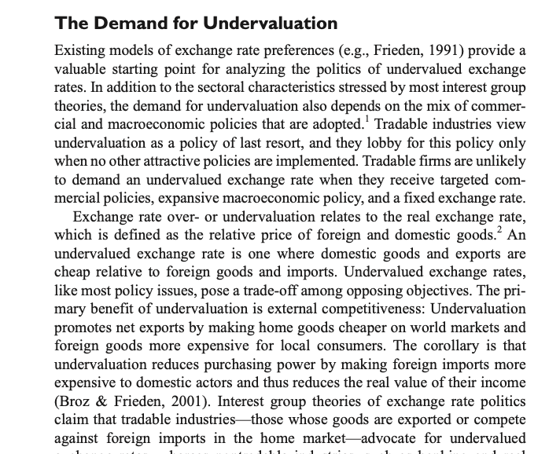
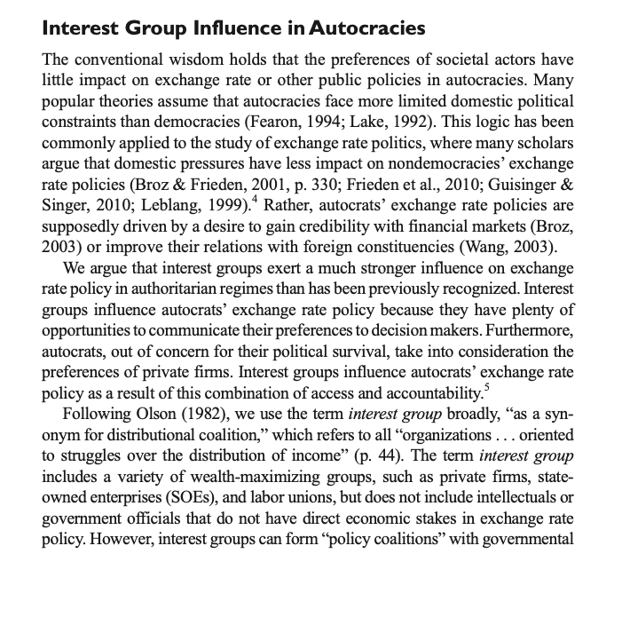
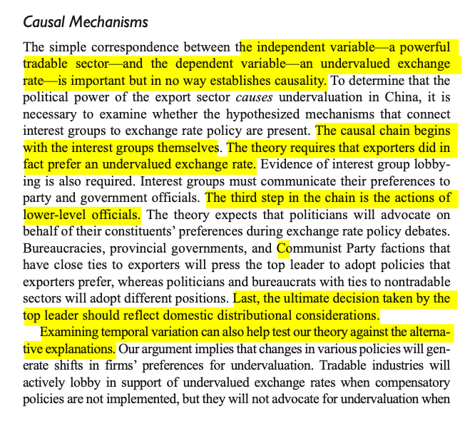
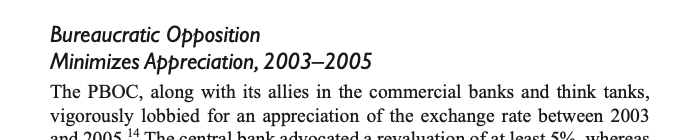
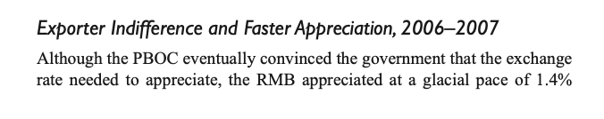
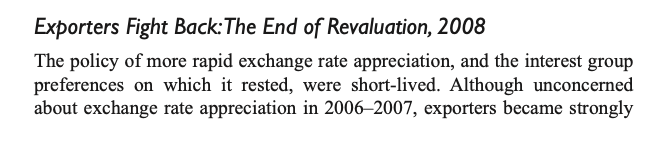
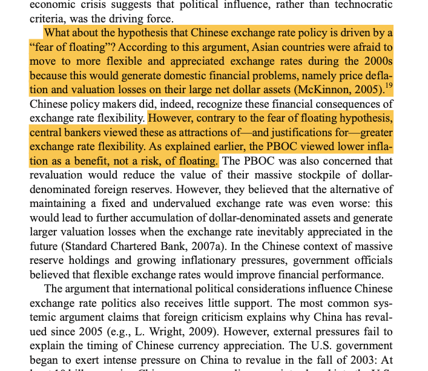
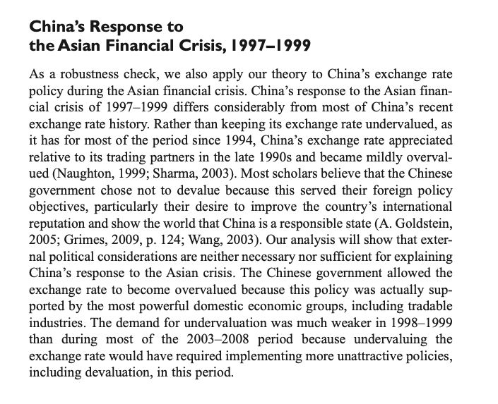
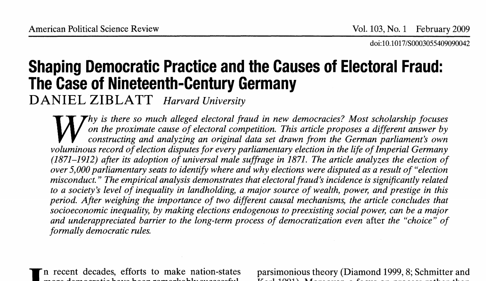

class: center, middle, inverse
background-image: url("https://encrypted-tbn0.gstatic.com/images?q=tbn:ANd9GcTJozSlW1llA3rqC2TtBP3lKmtV-JeBuyEdlg&usqp=CAU")
background-position: 100% 0%
background-size: 10%

# Case Studies, Historical Analysis, and Process Tracing

## .texttt[a practical guide]

## GLOA720

### Byunghwan Son

---
class: inverse, middle, center

#Every case study is inherently   a .red[comparative] study.
---

class: inverse, bottom, middle
background-image: url(https://thumbs.gfycat.com/WarySlightFeline-small.gif)
background-size: 100%
background-position: middle

--

# 
 'Cause you can compare you to yourself. 

---
class: inverse, middle, left
background-image: url("https://cdnb.artstation.com/p/assets/images/images/011/100/469/large/alex-langletz-v2.jpg?1527847944")
background-size: 100%
background-position: center
# Really a quest of .green[identification] thru .green[Controls]

--

### - **within**-case comparison: sub-units or cross-time

--

### - across-case: [.red[apples] vs. .red[apples]] or [.red[apples] vs. .orange[oranges.]]

---
# **Structured** and **Focused** Comparison

--

## Focused

- not all, but .red[only select aspects] of each case
    - the .red[literature] determines the aspects (variables) chosen

--

- discussions stay within the purview of the variables identified

--

## Structured

- Units at the same level (or category)

--

- treated equally: all variables for each case

--

- Don't select on the dependent variable (or .red[don't exclude] only the ones that fit the story)

---

# Implementing a Case Study

--

1. .red[soaking and poking]: case immersion
  - exploratory, but goes on detail
  - literature review should be semi-established before this for '.red[[focus]]'
    
--

2. Identifying the variables
  - Independent, Dependent, and Control Variables
  - .blue[Operationalization]: what would you mean by '*stronger*'; '*increase*' ?
  - particularly important for qualitative research; '.red[structure]'

--

3. 'explanation'
  - developing the narrative
  - .green[describe] the relationship between the IV and DV
  - with a structure, .green[description] = .orange[analysis]
  
--

4. robustness
  - demonstrate the alternative explanations don't work
  - could be just a good explanation of the control variables

---

# The **Design** might be something like this:

## JS Mill's methods
--

<table class="tg">
<thead>
  <tr>
    <th class="tg-81hd" colspan="2" rowspan="2">MOST SIMILAR</th>
    <th class="tg-tqs3" colspan="5">'focused'</th>
  </tr>
  <tr>
    <td class="tg-3dwd">Independent Variable</td>
    <td class="tg-3dwd">other factor 1</td>
    <td class="tg-3dwd">other factor 2</td>
    <td class="tg-3dwd">other factor 3</td>
    <td class="tg-3dwd">Outcome Variable</td>
  </tr>
</thead>
<tbody>
  <tr>
    <td class="tg-ld9p" rowspan="2">'structured'</td>
    <td class="tg-fr75">Case A</td>
    <td class="tg-ki2o"></td>
    <td class="tg-hj7i"></td>
    <td class="tg-5t0f"></td>
    <td class="tg-34qp"></td>
    <td class="tg-igw2"></td>
  </tr>
  <tr>
    <td class="tg-fr75">Case B</td>
    <td class="tg-kolq"></td>
    <td class="tg-hj7i"></td>
    <td class="tg-5t0f"></td>
    <td class="tg-34qp"></td>
    <td class="tg-9dj7"></td>
  </tr>
</tbody>
</table>

--

<table class="tg">
<thead>
  <tr>
    <th class="tg-81hd" colspan="2" rowspan="2">MOST DIFFERENT</th>
    <th class="tg-tqs3" colspan="5">'focused'</th>
  </tr>
  <tr>
    <td class="tg-3dwd">Independent Variable</td>
    <td class="tg-3dwd">other factor 1</td>
    <td class="tg-3dwd">other factor 2</td>
    <td class="tg-3dwd">other factor 3</td>
    <td class="tg-3dwd">Outcome Variable</td>
  </tr>
</thead>
<tbody>
  <tr>
    <td class="tg-ld9p" rowspan="2">'structured'</td>
    <td class="tg-fr75">Case A</td>
    <td class="tg-upmr"></td>
    <td class="tg-e49f"></td>
    <td class="tg-cbze"></td>
    <td class="tg-ck8x"></td>
    <td class="tg-3oc2"></td>
  </tr>
  <tr>
    <td class="tg-fr75">Case B</td>
    <td class="tg-fyvs"></td>
    <td class="tg-hxh3"></td>
    <td class="tg-294z"></td>
    <td class="tg-4crs"></td>
    <td class="tg-3oc2"></td>
  </tr>
</tbody>
</table>
--
### Might be determined by what kind of .red[cases] to compare.
---

# An example summary table

## Pepinsky (2009)

--

.left-column[]

--

.right-column[

<table class="tg">
<thead>
  <tr>
    <th class="tg-12xo"></th>
    <th class="tg-fv0u">Malaysia</th>
    <th class="tg-fv0u">Indonesia</th>
  </tr>
</thead>
<tbody>
  <tr>
    <td class="tg-xdy0">Region </td>
    <td class="tg-zxw1" colspan="2">Southeast Asia</td>
  </tr>
  <tr>
    <td class="tg-xdy0">Economy</td>
    <td class="tg-zxw1" colspan="2">middle-income</td>
  </tr>
  <tr>
    <td class="tg-xdy0">religion</td>
    <td class="tg-zxw1" colspan="2">Islam</td>
  </tr>
  <tr>
    <td class="tg-4ey9">political  coalition</td>
    <td class="tg-zxw1">Malay elites +  Malay business</td>
    <td class="tg-zxw1">Native elites +  Chinese business</td>
  </tr>
  <tr>
    <td class="tg-spvt">Outcome of  the 1997 Crisis</td>
    <td class="tg-zxw1">authoritarian resilience</td>
    <td class="tg-zxw1">authoritarian breakdown</td>
  </tr>
</tbody>
</table>
]

---
class: inverse, middle, center

# But how do you .red[ACTUALLY] do it?

## Let's take a look at a .green[real] example

---

# Three Cases within a Case

---

# Literature Review, of course

.pull-left[

]

.pull-right[

]

---

# Contextualization and Variable Description

.pull-left[

]

.pull-right[

]

---
## The Three Cases

- Case1:
   
  
--

- Case2: 
  

--
- Case3: 
  

---

## Alternative Explanation and Robustness Check

.pull-left[

]

.pull-right[

]
---
class: inverse, middle, center

# Comparative .red[Historical] Analysis

---

class: inverse, middle, right

.pull-left[]
.pull-right[   
### "By means of   .yellow[comparative analysis],   I want to preserve a sense of .red[historical particularity]   as far as I can, while still .green[comparing different counts]" 
-- Reinhard Bendix (1976)  
]

---

# Comparative .red[Historical] Analysis

--

- Case Study, but over time.

--

- .grenn[Sequence] matters.

--

  - often, though not always, used for caausal inference (hence the discussions about necessary and sufficient causes in Mahoney (2004))

--

- methods
  - typological theory (Mill's methods, but with sequence)
  
      - process tracing (analysis): a complete anatomy of the intervening process
      - sequence arguments: good at showing '.red[how]'; *less* of causal inference
--

  - formal theory and fuzzy sets: *not very recommendable*  
    
---

class: inverse, top, right
background-image: url(https://i.makeagif.com/media/8-11-2015/bBK7vu.gif)
background-size: 100%
background-position: top, center

# Process tracing : 
### making sure *every* step counts

---

# A Quick Example (the 2nd half of the paper)

---

# A Quick Example

- Late 19C Germany

- Hypothesis: high land inequality <i class="fas fa-arrow-alt-circle-right"></i> electoral fraud 

--

   - .content-box-blue[existence of strong landed elites]

--

   - .content-box-green[the adoption of universal male suffrage in Germany]

--

   - .content-box-red[landed elites social power erodes]

--

   - .content-box-purple[landed elites pressure local officials (appointment; revenue)]

--

   - .content-box-red[local officials remove voters fromm voter rolls]

--

   - .content-box-yellow[systemic electoral fraud observed]

