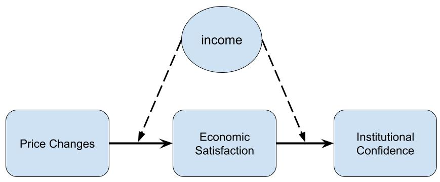
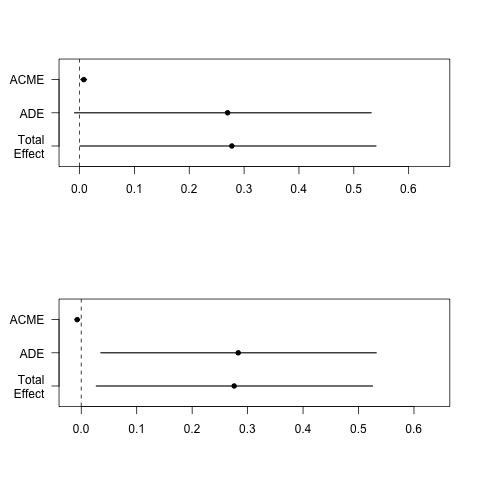

layout: true
background-image: url(images/gmu_logo_bw.jpg)
background-position: 100% 0%
background-size: 10%

```{r setup, include=FALSE}
htmltools::tagList(rmarkdown::html_dependency_font_awesome())
# to use FontAwesome
library(knitr)
library(tidyverse)
# set default options
  opts_chunk$set(echo = FALSE,
                 fig.width=7,
                 fig.height=4,
                 dpi=300)
library(fs)
library(magick)  
library(ggplot2)       # for data visualization

# for the project  
library(interplot)
library(expss)
library(lme4)          # for multilevel models
library(cowplot)
library(stargazer)
library(ggeffects)

load("/Users/bson3/Google Drive/international political economy/crisis and support/MPSA2021/MPSA2021_2.RData")
```


<script type="text/x-mathjax-config">
MathJax.Hub.Config({
  TeX: {
    Macros: {
      yellow: ["{\\color{yellow}{#1}}", 1],
      orange: ["{\\color{orange}{#1}}", 1],
      green: ["{\\color{green}{#1}}", 1],
      red: ["{\\color{red}{#1}}", 1]
    },
    loader: {load: ['[tex]/color']},
    tex: {packages: {'[+]': ['color']}}
  }
});
</script>


---

class: inverse, left, middle
background-image: url(https://static.financialsense.com/historical/users/u165/images/2013/0102/mother-trust-government-wall-art.jpg)
background-size: cover

---

class: inverse, left
background-color: black

# .red[Institutional Confidence]

--

## - A bunch of synonyms
### : *political trust*; *trust in gov't*; *confidence in govt't*

--

## - "belief that institutions are doing .green[the right thing]"

--

## - Important
### : <i class="fas fa-dharmachakra"></i> lynchpin of the basic workings of .yellow[democracy]
### : <i class="fas fa-heart-broken"></i> reflects political disenchantment

---

class: inverse, left, top
background-image: url(https://sevenpillarsinstitute.org/wp-content/uploads/2017/11/Political-Inequality.jpeg)
background-size: contain

# The Rich and The Poor

--

### different .yellow[external efficacy] 

--

### <i class="fas fa-arrow-circle-right"></i> .red[evaluative] of institutions

---

class: inverse, right, top
background-image: url(https://media.giphy.com/media/1BdNuPXC6jp6OEAfbW/giphy.gif)
background-size: contain
background-position: center, middle

# In a .red[bad] economy,<br> the rich to insitutions: 

---

class: inverse, left, middle

# The rich are more .yellow[sensitive].

--

# The rich's confidence in institutions .green[increase] more than the poor's does when the economy is .green[good].

--

# The rich's confidence in institutions .red[decrease] more than the poor's does when the economy is .red[bad].


---

# Research Design

### .blue[Data]: WVS (three waves), .orange[democratic] countries (polity>5)

--

### .blue[DV]: Institutional Confidence (factor)

--

### .blue[IV]: RER (Rodrik 2008) & Income

--

### .blue[Model]: multilevel mixed effect linear regression

.large[Confidence in  Government] =

$$\beta_{0} + \beta_{1}{RER}_{i} + \beta_{2}{Income}_{ij} + \red{\beta_{3}}{RER}_{i} \times {Income}_{ij} + \kappa_{ij} +  \upsilon_{i} + \varepsilon_{ij}$$

---

# Descriptive Statistics

```{r, message=FALSE, echo=FALSE, warning=FALSE}
# The baseline and benchmark models

model1 <- lmer(factor1 ~ # benchmark model
                 c_income*d3rer  
               + c_age + male + c_interest + c_edu + trust + c_ideo 
               + lngdppc + growth + crisis_3
               + (1 | match),
               data = MPSA2021_2)


class(model1) <- "lmerMod"
```

```{r, message=FALSE, echo=FALSE, warning=FALSE, results="asis"}
stargazer(data = model1@frame, 
          omit = "match",
           # type="text",
          # type="html",
          type="html",
          header=FALSE,
          label = "tab:sum",
          font.size = "small",
          title = "Summary Statistics (based on the benchmark model)",
          covariate.labels = c("Inst. Confidence",
                               "income", 
                               "RER",
                               "age",
                               "male",
                               "interst in politics",
                               "education",
                               "interpersonal trust",
                               "ideology",
                               "ln(GDP per capita)",
                               "economic growth",
                               "financial crisis")
)
```

---

# Institutional Confidence, RER, and Income

```{r, message=FALSE, echo=FALSE, warning=FALSE}
br <- c(-8, 0, 9)
MPSA2021_2$hilo <- cut(MPSA2021_2$c_income,
                       breaks = br, include.lowest = TRUE,
                       labels = c("low income", "high income"))
```

```{r scatter, message=FALSE, echo=FALSE, warning=FALSE}
subset(MPSA2021_2, !is.na(hilo)) %>%
  ggplot(aes(d3rer, factor1, color = hilo)) +
  geom_point(size=0.1, alpha=1/50) +
  geom_smooth() +
  labs(x = "(under) <- Currency Valuation -> (over)",
       y = "Institutional Confidence") +
  theme(legend.title = element_blank()) +
  scale_color_manual(values=c("red", "blue"))
```

---

# The Benchmark Result

```{r, message=FALSE, echo=FALSE, warning=FALSE}

margin1 <- interplot(m=model1, var1="c_income", var2="d3rer", hist = TRUE)   +
  labs(
  x = "Currency Valuation",
  y = " ",
  title = "A. Income and Institutional Confidence") + 
  geom_hline(yintercept = 0, linetype = "dashed", color = "red")

hypo <-  ggpredict(model1, # RER is the conditioning var
                         terms = c("d3rer", "c_income[-5, 0, 6]")) 
hypo1 <- plot(hypo) + labs(
      x = "(under) <- currency valuation -> (over)",
      y = " ",
      title = "B. By income levels") +
      scale_color_manual(name=" ", 
                        labels = c("low income", "mean income",
                                    "high income"),
                         values = c("red", "black", "blue")) +
      theme(legend.position = "bottom")
	  
library(cowplot)
	  cowplot::plot_grid(margin1, hypo1,
	          nrow=1)

```
---
class: inverse, left, middle
background-color: black

# But .yellow[wait], 
# an **alternative** explanation might still work!

--

## What if it's all b/c *the rich have more to .green[earn] and .red[lose]*?
   
   
      
---

# The idea of a causal mediation

.center[

]
```

---

# The result, however.
.center[
]

---

# Conclusion

.content-box-green[
### The rich are more .red[sensitive] than the poor to national economic conditions in forming institutional confidence
]

--

.content-box-yellow[
### The findings might shed some light on how .red[backsliding] happens.
]

--

.content-box-purple[
### A rare attempt to show how international .red[financial] subject can affect political opinions.
]

