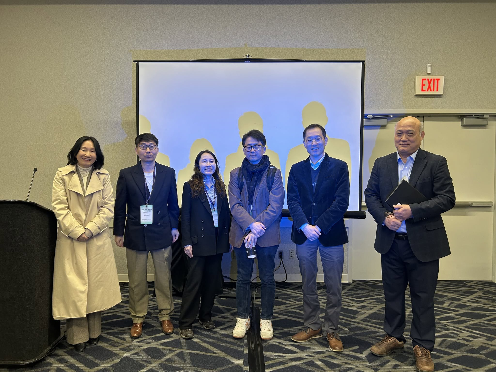

# Quorum

- Article VI: "The quorum consists of at least three due-paying members and at least two members of the Governing Board"

# Membership 

- AKPS operates on your membership dues. \$50 for professors/PhDs and \$20 for students.

- You can pay through checks (Ji Young Choi. Address available at the AKPS webpage: <https://www.akps.org/announcements>) or Paypal (paypal.me/akps89).

- If you haven't already, join AKPS mailing list (<https://groups.google.com/u/2/g/koreanpoliticalstudies>) – link also available at the AKPS webpage.

# AKPS business

- Korean Political Studies Colloquium (KPSC)
  - The 2025-6 cohort successfully finished the season in May 2026.
  - The 2026-7 cohort is not formed. KPSC will start the first session of the season in October.
    - CfP went out in early July; three times more applicants than eventually selected.
    - current co-conveners: Jiun Bang (Colorado College); Jenna Gibson (University of Notre Dame); Edward Goldring (University of Melbourne); Eun A Jo (College of William & Mary); Hyerin Seo (University of Birmingham); Sangyong Son (National University of Singapore); Byunghwan Ben Son (George Mason University)   

- Two successful AKPS panels at ISA 2026 (Columbus, Ohio)

  

- New term for the President & Vice President

- Call for Application (Board Members for AKPS)
  - Two vacancies (starting from October 2026)
  - One elected in ISA 2027, the other in APSA 2027
  - Article V: "elected for staggered three-year terms by a plurality vote of the due-paying members present at the annual membership meeting"
