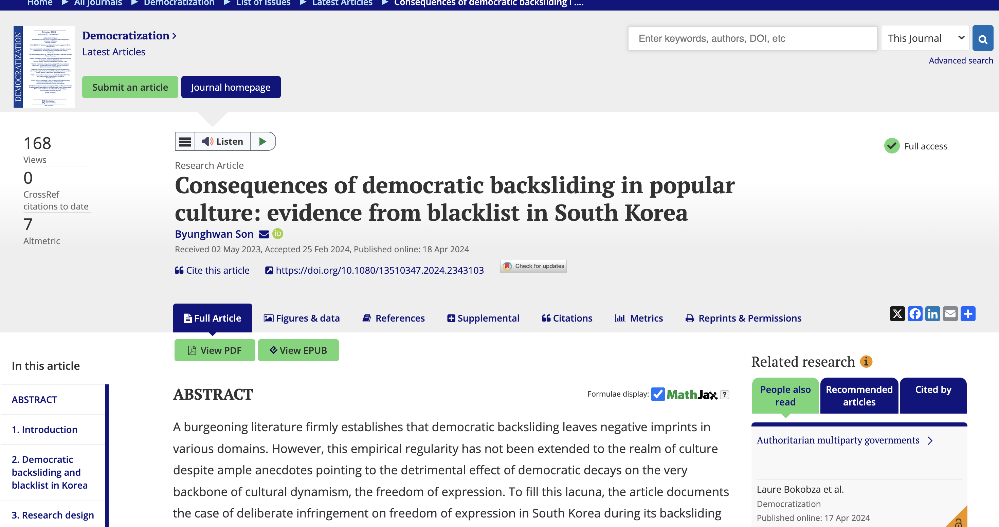
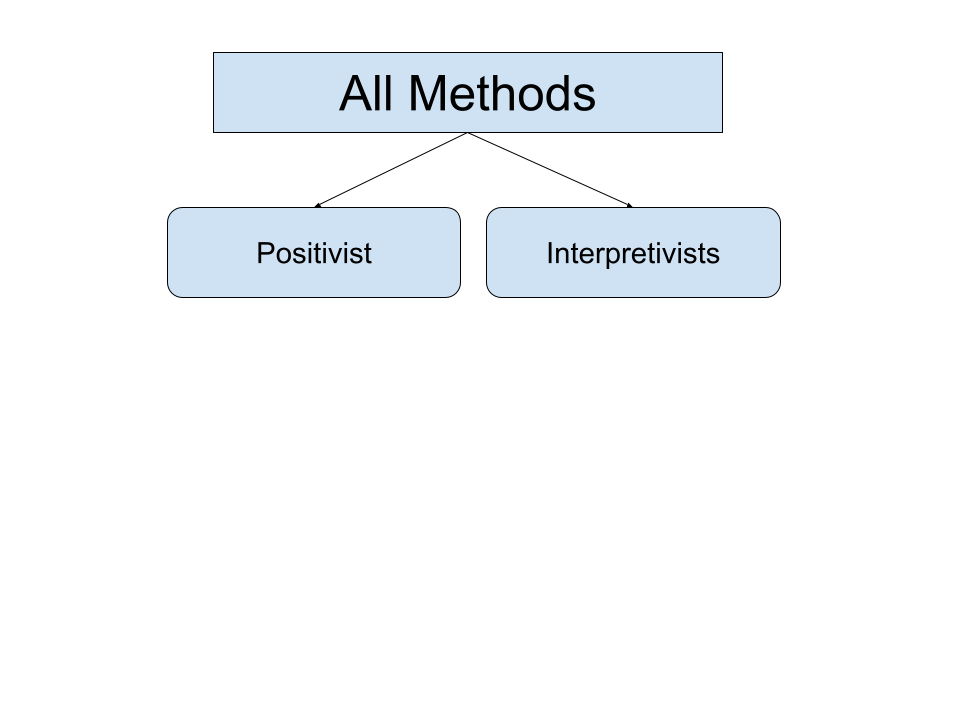
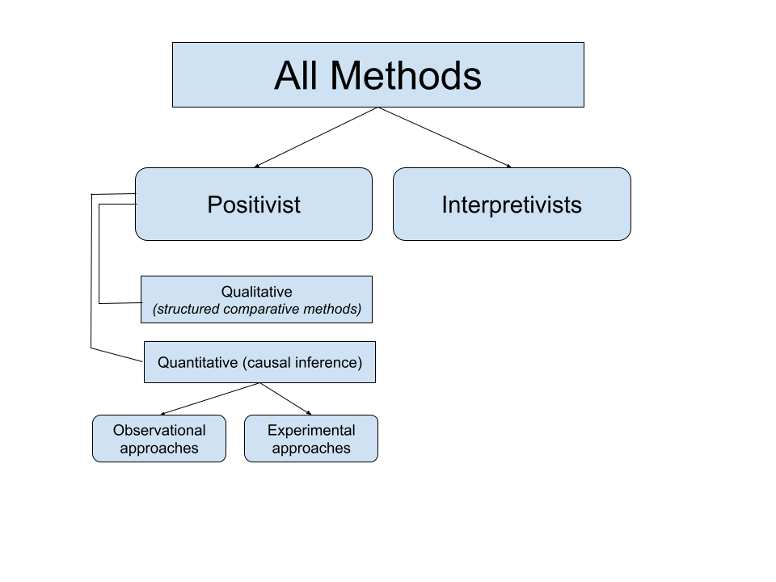
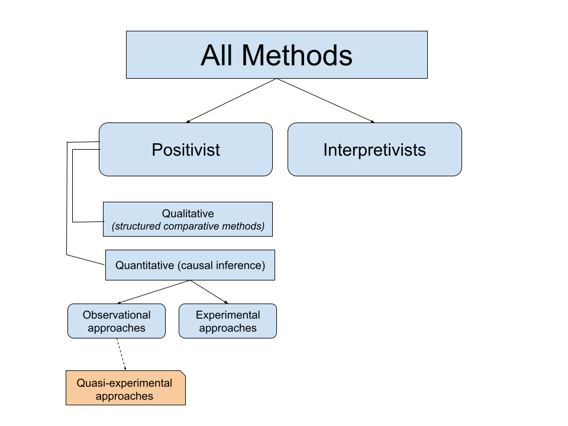
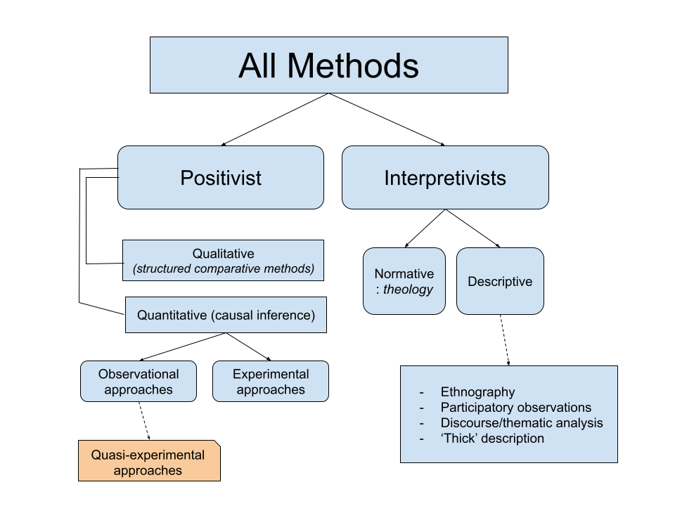
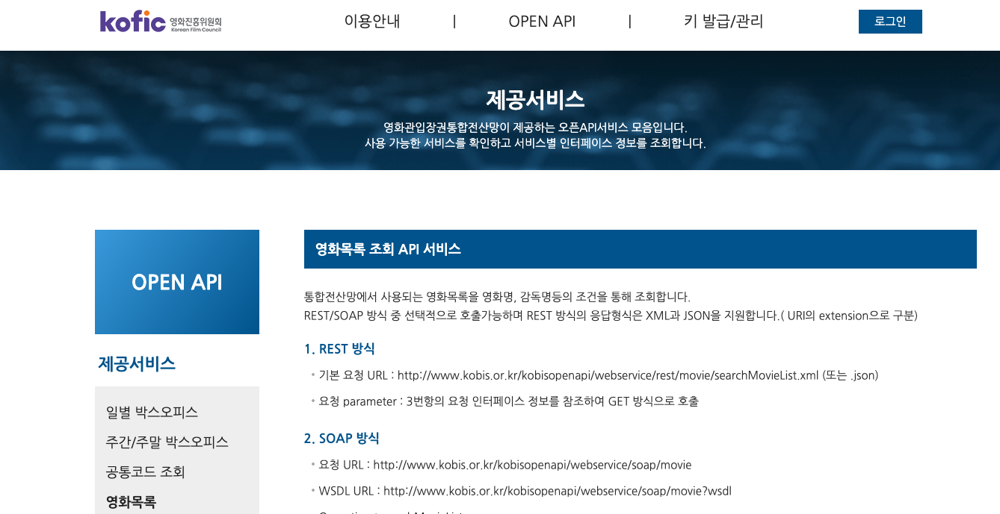

```{r setup, include=FALSE}
# to use FontAwesome
#htmltools::tagList(rmarkdown::html_dependency_font_awesome())

library(fontawesome)
library(dplyr)
library(ggplot2)
library(tinytable)
library(modelsummary)

knitr::opts_chunk$set(warning = FALSE, message = FALSE, error=F, echo=F)
options(htmltools.preserve.raw = FALSE) 

```


background-color: #3a4a37
class: inverse, middle
background-image: url(https://textvulture.github.io/portrait_July2024.png)
background-position: 23cm 2.5cm
background-size: 20%

# .large[A sneak peek into <br> a .yellow[quantitative] researcher's workflow] <br><br>
----

### .right[Byunghwan Ben Son (GLOA, GMU)]

### .right[GLOA 491 Guest Lecture]


---

# An .pink[example] to work with:

{width="80%"}

---

class: inverse
background-image: url(https://github.com/textvulture/textvulture.github.io/blob/master/images/forestBackground3.jpg?raw=true)
background-size: 120%

--

<br><br>
- .LARGE[But This won't be a research presentation.]

  - .large[I mean you read the paper `r fa('paperclip', fill='orange')` .]

--

- .LARGE[Instead, we will take a look at how a paper like that is .yellow[conceived] and then .bluey[produced] (hence the title).]

--

- .LARGE[If you're interested in how this project was .pink[presented] in a conference, here's the link to the slides: [https://textvulture.github.io/presentations/bkv_slide.html#1](https://textvulture.github.io/presentations/bkv_slide.html#1) (MPSA 2021)]

---

class: inverse, left, top
background-image: url(https://media1.tenor.com/m/UQsZGD3pinAAAAAd/shall-we-begin-star-trek.gif)
background-size: 110%

# I am sure you must've <br> talked about this <br> .Green[a lot] already in this class.

--

# But we need to first talk about <br> .pink[where this research belongs.]


---


```{r, out.width="75%", fig.align='center'}



```


---


```{r, out.width="75%", fig.align='center'}



```


---


```{r, out.width="75%", fig.align='center'}



```


---


```{r, out.width="75%", fig.align='center'}

knitr::include_graphics("images/methods_tree_5.png")

```


---


```{r, out.width="75%", fig.align='center'}



```


---

class: inverse
background-color: black
background-image: url(https://github.com/textvulture/textvulture.github.io/blob/master/images/blacklist_eg.jpeg?raw=true)
background-position: right

# `r fa("book", fill='orange')` Blacklists, literally

--

## - names of individuals and groups

## - 'anti-government' or 'lefty' `r fa("flag", fill='red')`

## - mostly using existing lists <br> (open letter signatories)

--

## - exclusion and disadvantage

## - Govt: NIS, Blue House, MHST

## - discrete operation

---
class: inverse, middle
background-image: url(https://img.seoul.co.kr/img/upload/2016/12/08/SSI_20161208102613_O2.jpg)
background-position: right
background-color: black
background-size: contain

# "*Why have you not .red[sanctioned] <br> these [anti-government] <br> movie producers yet?*" <br><br> 

## **Kim Ki-choon**, <br> Park Geun-hye's Chief Secretary, <br> after watching *The Attorney* <br> to **Yoo Jin-ryong**, <br> Minister of Culture, Sports and Tourism. 


---

## The theoretical background: .orange[democratic backsliding] in South Korea <br> .small[Compromised .green[Freedom of Speech], in particular (V-dem)]

```{r, echo=F, warning=F, message=F, error=F, cache=T, fig.align='center', fig.width=11}

library(vdem) 
#remotes::install_github("xmarquez/vdem")

var <- c("v2x_freexp")

country <- c("South Korea", 
            "Hungary",
            "Russia")
  
  
expression <- extract_vdem(
  include_sd = TRUE,
  label_pattern = "expression"
)

library(geomtextpath)

expression %>% 
  filter(vdem_country_name == country) %>%
  filter(year>1979) %>%
  ggplot(aes(x=year, y=v2x_freexp, 
             fill=vdem_country_name, label=vdem_country_name)) +
    theme_minimal() +
  geom_vline(xintercept = c(2008, 2017), color="gray", 
                  linetype="longdash", alpha=0.9) +
  geom_ribbon(aes(ymin = v2x_freexp_codelow,
                  ymax = v2x_freexp_codehigh),
                  alpha=0.2) +
  geom_textline(aes(label=vdem_country_name,
                    color=vdem_country_name)) +
     theme(legend.position = "none",
      axis.text=element_text(size=20),
      axis.title=element_text(size=20)) +
  labs(x="year", y="Freedom of Expression Index")

```

---

background-image: url(https://img.khan.co.kr/news/2015/11/04/l_2015110401000555600049501.jpg)
background-position: right
background-size: 40%

# How to Get on the List

.pull-left[
```{r blacklist, echo=F, message=F, error=F, warning=F, result='asis'}

library(kableExtra)

txt_tbl <- data.frame(
  List = c("1", "2", "3", "4"),
  Based = c("2008", "2012", "2014", "2015"),
  Pres = c("Lee", "Park", "Park", "Park"),
  Reasons = c("critical of the govert; 'left-leaning' -- only 60 movie workers (but more, unidentified)",
              "supporting the opposition presidential leader",
              "participants of the open letter regarding the Sewol Ferry sinking; supporting the opposition candidate for Seoul Mayoral election",
              "participants of the open letter criticising government handling of the Sewol Ferry sinking") 
)


kable(txt_tbl) %>%
  kable_styling(full_width = F) %>%
  kable_styling("striped", full_width = F) %>%
  row_spec(0) %>% #, align = "center" seems to create an error: don't know why
    add_footnote(c(" 'based' is the year in which the event that the list is based on occurred."), notation="symbol") #%>%
#  column_spec(4, width = "10em")
#  #kable_styling(latex_options="scale_down")

```
]


---


---

background-image: url(https://pbs.twimg.com/media/ENzTfM7VUAEyaEI.jpg)
background-position: right
background-size: contain


# (Personal) Motivation

--

- This is upsetting `r fa('face-angry', fill='red')`.

--

  - But .pink[what] exactly am I upset about?
  
--

  - Suppression of freedom of speech? Yes, but more.

--

  - .green[personal] to me: 
      - *sleazy people ruining cool people's lives.* `r fa('face-tired', fill='orange')`
      
--

  - Okay, but how can I demonstrate this empirically?
  
--

    - Interviews? Fieldwork?
    - .red[Only] if the victims were really aware of things.


---


class: center, middle

# If only was there .orange[a complete database] that contains .pink[all credit information] for each of the movies in Korea ...


---

class: center, middle
background-image: url(images/kobis.png)
background-size: 100%

# If only was there .orange[a complete database] that contains .Blue[all credit information] for each of the movies in Korea .red[!!!]

--

# .LARGE[.pink[Ko]rea .pink[B]ox Office .pink[I]nformation .pink[S]ystem (.pink[KOBIS])]

---

# KOBIS, API

--



---

# Getting the data using API (.tiny[there was a daily limit])


```{r, echo=T, eval=F}
# Scraping the simple information of Korean movie workers

library(tidyverse)
library(jsonlite)

masterlist1 <- data.frame()

for (I in 1:500){
  url_jsonlist <- paste0("http://kobis.or.kr/kobisopenapi/webservice/rest/people/searchPeopleList.json?key=ee223f1aa3ad93af2be4362133f6a174&curPage=", I ,"")

  temp1 <- as.data.frame(fromJSON(url_jsonlist))
  masterlist1 <- plyr::rbind.fill(masterlist1, temp1)
  Sys.sleep(1)
}

... 

```

### After quite a bit of data cleaning `r fa('snowplow', fill='blue')` , a complete list of movie workers' participation in movie projects on .pink[a yearly] basis.

---


.content-box-green[
# The Hypotheses

### 1. Being blacklisted .red[decreases] a movie worker's chances of securing a movie job.

### 2. The negative career effect of being blacklisted is larger for .red[non-actor] movie workers than for actors.
]

--

.content-box-yellow[
# The Data

### A panel data set based on the KOBIS moive data base (API) matched with the Blacklists
### N=1.6 mil, unbalanced; 2012 = treatment year (when most things *really* happened)
]

---

#Trend:

## Number (L) and Portion (R) of the .red[blacklisted] movieworkers (.violet[employed])

.pull-left[]
.pull-right[]

---

## Model & Result (Difference-in-Difference)


\begin{equation}
ln(movies + 1) = \beta_0 + \color{red}{\beta_1}Blacklisted_{it} \times Treatment_{t} + \mathbf X + FE(unit, year, role) + \epsilon_{it},
\end{equation}


--

```{r, echo=F}

# readRDS('/Users/bson3/GitHub/bkv/table_re.rds')


```

<iframe src="table.html" width="100%" height="500px"></iframe>

---

# .Large[.green[Event Study] Approach]
.pull-left[### Benchmark
```{r, echo=F, fig.align='center'}
knitr::include_graphics("https://github.com/textvulture/textvulture.github.io/blob/master/images/bkv_event.jpeg?raw=true")
```
]

--

.pull-right[### .red[Non]-actors
```{r, echo=F, fig.align='center'}
knitr::include_graphics("https://github.com/textvulture/textvulture.github.io/blob/master/images/bkv_non_actor.jpeg?raw=true")
```
]

---

# RnR and Endless Robustness Check


---

class: inverse
background-image: url(https://img2.yna.co.kr/photo/yna/YH/2017/06/14/PYH2017061410710001300_P2.jpg)
background-position: right
background-size: contain
background-color: black

# .large[**Conclusion**]

## `r fa("microphone-alt-slash", fill='yellow')` backsliding messes with culture by <br> suppressing .yellow[freedom of speech]

--

## `r fa("user-secret", fill='red')` often unknown as operating .red[discretely] 

--

## `r fa("recycle", fill="green")` authoritarian toolkits .green[recycled]

--

## `r fa("trash-alt", fill='orange')` another reason backsliding is .orange[undesirable]

--

## `r fa("fist-raised", fill='#948DF0')` democracy eventually worked .violet[this time]

---

# Maybe .red[not] interested in quanitative methods per se, but still want to use some data in your project? Here are some great sources that offer visualization. No coding skills needed. Drop-down menus only.

---

# Variety of Democracy


---

# World Value Survey

---

# World Development Indicators


---

class: inverse, center, middle
background-image: url(images/aiddata.png)
background-size: 100%

# Chinese Development Finance [Click](https://china.aiddata.org/)


```{r, include=F, echo=F }
rm(list = ls())
```


