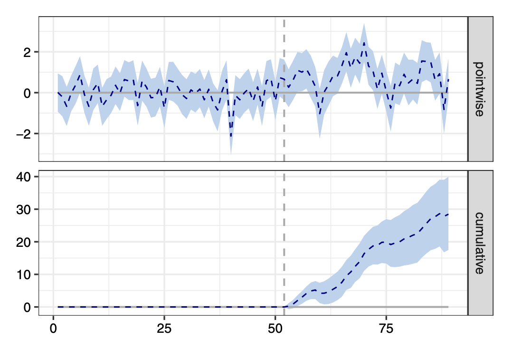
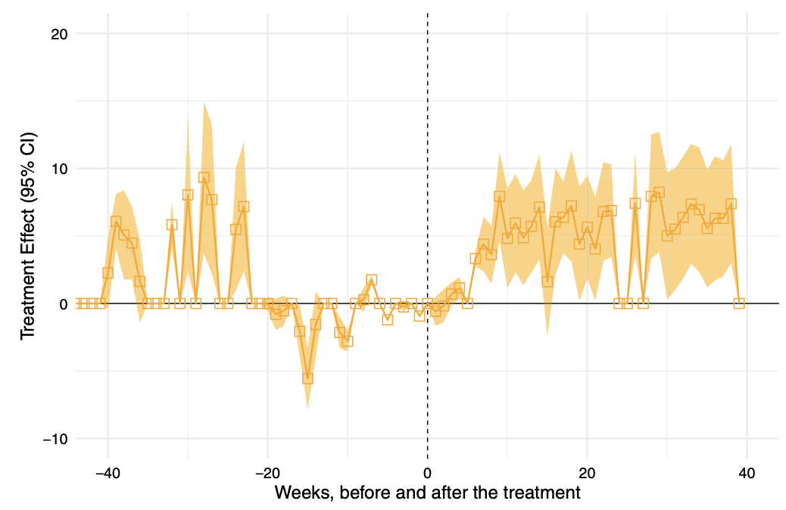

```{r setup, include=FALSE}
# to use FontAwesome
#htmltools::tagList(rmarkdown::html_dependency_font_awesome())

library(fontawesome)
library(dplyr)
library(ggplot2)
library(tinytable)
library(modelsummary)

knitr::opts_chunk$set(warning = FALSE, message = FALSE, error=F, echo=F)
options(htmltools.preserve.raw = FALSE) 

```


background-color: #094e0d
class: inverse, middle
background-image: url(mugshot2025a_circle.png)
background-position: 23cm 2.5cm
background-size: 20%

# .large[K-pop Fans in the United States:] <br> .large[A .yellow[Data-Driven] Approach] <br><br> .pink[.tiny[AAPI Sping Speaker Series 2026]]<br>
----

## .right[Byunghwan Ben Son <br> .tiny[(Associate Professor, GLOA, GMU)]]

---


# Before we start:

### The slides are completely .pink[online] and you can easily access it.

```{r, echo=F, include=F}
# 
# library(qrcode)

# png(file="qrAAPI2026.png")
# qr <- qr_code("https://textvulture.github.io/presentations/aapi2026.html")
# plot(qr)
# dev.off()

```

```{r, fig.align='center', out.width="400px"}


```

---

class: inverse, center, middle
background-image: url(https://raw.githubusercontent.com/textvulture/textvulture.github.io/refs/heads/master/images/forestBackground.jpg)
background-size: 100%

# .huge[**Stuff We Talk About**]

--

# K-pop Fans in the United States: A Data-Driven Approach

---

class: inverse, center, middle
background-image: url(https://raw.githubusercontent.com/textvulture/textvulture.github.io/refs/heads/master/images/forestBackground.jpg)
background-size: 100%

# .huge[**Stuff We Talk About**]

# K-pop Fans .yellow[in the United States]: A Data-Driven Approach

---

class: inverse, center, middle
background-image: url(https://raw.githubusercontent.com/textvulture/textvulture.github.io/refs/heads/master/images/forestBackground.jpg)
background-size: 100%

# .huge[**Stuff We Talk About**]

# .yellow[K-pop Fans] in the United States: A Data-Driven Approach

---

class: inverse, center, middle
background-image: url(https://raw.githubusercontent.com/textvulture/textvulture.github.io/refs/heads/master/images/forestBackground.jpg)
background-size: 100%

# .huge[**Stuff We Talk About**]

# K-pop Fans in the United States: .yellow[A Data-Driven Approach]

---
.full-width-yellow[
# The Big Questions
]

<br>
<br>
--

## 1. How do fans perceive K-pop? Something .pink[weird]?

--

## 2. What do .red[non-fans] think of this? 

--

## 3. Do fans go .purple[beyond] just being fans?

--

## `r fa('lightbulb', fill='red')` A showcase of what .orange[data-driven] approach to K-pop is like.

---

.full-width-yellow[
# Based on four papers
]
<br>
--

### - Kim & Son. 2026. "Beyond the Hype: Fans' fascination and reservations about K-pop," Presented at Eastern Sociological Association Annual Meeting. Washington DC. <br> .white[.]

--


### - Kim & Son. 2025. "K-pop Fan Perceptions and Negotiation of Alternative Forms of Masculinities," *Journal of Men's Studies*, Forthcoming. [Link](https://journals.sagepub.com/doi/10.1177/10608265251394364) <br> .white[.]

--

### - Son & Kim. 2025. "Contours of Fandom Political Activism," Under-Review. <br> .white[.]

--

### - Son. 2024. "Foreign Pop Culture and Backlash: the case of non-fan K-pop Subreddits during the pandemic," *Journal of Cultural Economics*, 48 (1): 117-143. [Link](https://link.springer.com/article/10.1007/s10824-023-09475-w)

---

background-image: url(https://media1.giphy.com/media/v1.Y2lkPTZjMDliOTUyaHAxYXAwd3A3ZDRqdjM5djZnYWU5aWl2dHJ5dDY0MHVuOXM1eTNlYSZlcD12MV9naWZzX3NlYXJjaCZjdD1n/64aBXTVfd90zyUH2da/giphy.gif)
background-position: center
background-size: contain

---

.full-width-green[
# I said .yellow[data]. But what kind of data?
]
<br>
--

.content-box-red[
### Online Survey (N = 920)
- .large[Conducted via Qualtrics between 2020 and 2021 (/w multiple validity checks)]
- .large[Initial sample: 1710 participants age 17+; 920 were U.S. residents]
]
--

.content-box-blue[
### In-depth Interviews (N = 110)
- .large[Conducted in two phases:].Large[Phase 1: (2020–2021); Phase 2: (2022–2023)]
- .large[Interviews ranged from 30 minutes to 3 hours; .purple[semi-structured]]]

--

.content-box-yellow[
### Sub-reddit posts text (N $\approx$ 2.5k )
- .large[r/WeHateKpop and r/Cringetopia]]

---

class: inverse, center
background-image: url(https://miro.medium.com/v2/resize:fit:1000/0*l2ug-goAfVBRS54J.gif)
background-color: black
background-size: 100%

# .LARGE[**.yellow[Why] are they attracted to K-pop?**]

---

# The likes and dislikes .tiny[(interview data, multiple answers)]

.pull-left[

]

--

.pull-right[

]

---

.full-width-blue[
# But the struggle is real.
]
--
<br>
.pull-left[
### .blue[**Fans:**] <br>K-pop is high-quality music/performance.

```{r, out.width="110%"}
knitr::include_graphics('https://i0.wp.com/foolishwatcher.com/wp-content/uploads/2025/03/the-office-thumbs-up-scotts-tots-yep.gif?fit=500%2C282&ssl=1')
```
]
--

.pull-right[
### .red[**non-Fans:**] <br>Gay-pop; weird foreign culture

```{r, out.width="110%"}
knitr::include_graphics('https://media0.giphy.com/media/KOUp2nbwHm7vy/giphy.gif')
```


]

---

class: inverse, bottom
background-image: url(https://raw.githubusercontent.com/textvulture/textvulture.github.io/refs/heads/master/images/forestBackground4.jpg)
background-size: 100%

# Does everybody accept K-pop (and its uniqueness)?

--

# After all, it's a .yellow[foreign] culture. What do those who are .pink[not fans] of K-pop think? ('contact theory')


---
# How .orange[perceptions on foreign culture] would come along upon .green[good news]


```{r, echo=F, out.width="80%", fig.align='center'}

library(DiagrammeR)

simple <- grViz("
digraph simple {

  graph [
    layout  = dot,
    rankdir = LR,   // top → bottom
    ranksep = 0.75,  // vertical spacing
#    nodesep = 3   // horizontal spacing
  ]

  node [shape = circle, 
        style = filled, 
        fixsize = true,
        width = 2,
        fillcolor = \"#f7f7f7\",
        fontsize = 20, fontname = \"Helvetica\"]

  a [
      label = \"Positive Portrayal\\nof Korea\",
      fillcolor = \"#65E0F0\"
      ]

  d [
      label = \"Backlash\",
      fontsize = 25
  ]
  

  a -> d [style=dashed, color=gray]

 

}
")

simple

```
  
---
# How .orange[backlash] would come along upon .green[good news] on Korea


```{r, echo=F, out.width="80%", fig.align='center'}

library(DiagrammeR)

simple <- grViz("
digraph simple {

  graph [
    layout  = dot,
    rankdir = LR,   // top → bottom
    ranksep = 0.75,  // vertical spacing
#    nodesep = 3   // horizontal spacing
  ]

  node [shape = circle, 
        style = filled, 
        fixsize = true,
        width = 2,
        fillcolor = \"#f7f7f7\",
        fontsize = 20, fontname = \"Helvetica\"]

  a [
      label = \"Positive Portrayal\\nof Korea\",
      fillcolor = \"#65E0F0\"
      ]
  b [label = \"K-pop\"]
  c [
      label = \"Pre-formed\\nNegative Image\\nof Korea\",
      fillcolor = \"#F0658A\"
      ]
  d [
      label = \"Backlash\",
      fontsize = 25
  ]
  
  a -> c
  b -> c
  c -> d
  a -> d [style=dashed, color=gray]

 
  { rank = same; a; b }
  
}
")

simple

```
  
---

# Covid-19 News: .Blue['Korea was competent!'] (US news coverage)  

--

```{r, echo=F, fig.width=14, fig.height=7.5}

library(haven)
library(tidyverse)


trend <- read_dta("/Users/bson3/Google Drive/international political economy/kpop/reddit/data/grtrend.dta")
trend %>% 
  mutate(Rdate = as.Date(date, "%Y-%m-%d")) %>%
  mutate(cumul10 = cumul/10)-> trend

news <- read_dta("/Users/bson3/Google Drive/international political economy/kpop/reddit/data/lexis_korea_covid_2020.dta")
news %>% 
  mutate(Rdate = as.Date(date, "%Y-%m-%d"))  -> news

ggplot(NULL, aes(x=Rdate)) +
  geom_histogram(data = news, 
                 aes(x=Rdate,
                     color='grey',
                     size=NA),
                 alpha=0.5) +
  geom_line(data=trend,
            aes(y=cumul10,
                color='darkblue'),
            size=2) +
  theme_minimal(base_size = 20) +
  guides(color=guide_legend(" ")) +
  scale_color_manual(labels = c("Google Trend/10", "News"),
                     values = c('darkblue', 'grey')) +
  scale_x_date(date_breaks = "2 month", date_labels = "%m-%y") +
  theme(
    legend.position = c(0.1, 0.9),
    legend.direction = "vertical"
    # legend.text=element_text(size=10),
    # axis.text=element_text(size=10),
    # axis.title=element_text(size=10)
    ) +
  labs(x="Date",
       y="") +
  geom_vline(data=trend, 
             xintercept = as.Date("2020-03-15"),
             linetype = 2,
             color = 'red')

```

---


background-image: url(kpopimages/subreddit_eg.png)
background-size: contain
background-position: right

# Two (Sub)Reddits

## - r/WeHateKpop (now defunct)

## - r/Cringetopia

--

### Very likely this is .ornage[all] they know about Korea.

--

### K-pop skepticism = Korea skepticism

--

### Almost all posts are skepticism of K-pop and fans: <br> .purple[number of posts] = .green[strength of backlash]


---

.full-width-brown[
## r/WeHateKpop: the effect of Pandemic News on Backlash<br> .tiny[(interrupted time-series analysis)]
]
<br>
--

```{r, echo=F, fig.align='center', out.width="75%"}



```


---

class: inverse, center, middle
background-image: url(https://raw.githubusercontent.com/textvulture/textvulture.github.io/refs/heads/master/images/forestBackground3.jpg)
background-size: 120%

# .LARGE[But would that be a function of a different factor such as .yellow[anti-Asian racism] during the pandemic?]

--

## .bluey[If only there's some Asian topic not connected to K-pop...]

---

.full-width-brown[
## r/Cringetopia: .bluey[K-pop] posts compared to .pink[China] posts .tiny[(Difference-in-Difference model)]
]
<br>
--


```{r, echo=F, fig.align='center', out.width="75%"}



```


---


background-image: url(kpopimages/gender.jpg)
background-position: right
background-size: 60%


# .hl1[Fans push back]:

--

### - When asked about the masculinities <br>of K-pop male idols...

--

### - .green[normalization] of soft masculinty

--

### - Fan .orange[negotiation]: <br>'It's a different kind of masculinity!'

---
class: inverse, bottom
background-image: url(https://media1.giphy.com/media/v1.Y2lkPTZjMDliOTUyOHl6Y21ubGpheHMwcW5kc2Z6dmI0NDRoN3Bkd2VsYWswd3VkcXA4aCZlcD12MV9naWZzX3NlYXJjaCZjdD1n/l0ErKpKOIQgOgdaXS/200w.gif)
background-size: 100%

# .LARGE[**Beyond just being a fan.**]

---


background-image: url(https://s.france24.com/media/display/25804858-7aa7-11eb-8401-005056bf87d6/w:1280/p:3x4/MilkTea.jpg)
background-position: right
background-size: contain

--

# `r fa('hand-back-fist', fill='red')` K-pop fans & youth activism

--

## - Milktea Alliance in SE Asia

--

## - Chilean youth protests 

--

## - S. Korean anti-insurrection protest

--

# `r fa('hand-point-right', fill='blue')`  Does K-pop fandom drive <br> .pink[youth political participation]?


---

class: inverse, middle
background-image: url(https://raw.githubusercontent.com/textvulture/textvulture.github.io/refs/heads/master/images/forestBackground2.jpg)

# This is an important question.

--

# Youth politics literature:

## - Young people hate .pink[politics] and don't want to be .Green[associated] with it.

--

## - Fans only care about .bluey[non-political] social engagement.

--

# *Is K-pop .yellow[different]? How (much)?*

---

background-image: url(kpopimages/KpopTheory.png)
background-position: right
background-size: contain

# **The big idea**

--

## - Fandom is not monolithic.

--

## - 'What K-pop means to you' matters.

--

## - The broader the perception,<br> the more .red[tolerant] of <br>fellow fans' political engagement <br>.purple[in the name of K-pop fans].

---

.full-width-blue[
# Two Political Events where the Fandom was Involved
]
<br>
--

.pull-left[
.Large[**Partisan**: Tulsa Rally Prank]

]

--

.pull-right[
.Large[**Less Partisan**: BTS-BLM]

]
---

.full-width-blue[
# Argument
]
<br><br>
--

.content-box-red[
## 1: Fans who perceive K-pop as transcending entertainment are more likely to support fandom political activism than others.
]

--

.content-box-green[
## 2: This relationship is weaker for highly partisan events (Tulsa prank vs.BLM) -- *'there's a limit to it.'*
]

---

.full-width-blue[
# Data and Operationalization (survey)
]
<br><br>
--

## - same data (survey + interview)

--

## Key Variables (survey):
- .Large[**Outcome**: .red[Support] for fandom activism. Ordered (4 choices)]
- .Large[**Predictor**: Perceived .red[scope] of K-pop. A factor variable (`factor`)]

--

## Method: ordered logit (survey)

<span style="font-size: 180%;">
$$
Attitude_k^i = \color{red}{\mathbf{\beta_1}}Effect_k^i + \mathbf{X} + ϵ_k^i
$$
</span>


---

background-image: url(kpopimages/BLM_Tulsa.png)
background-size: contain
background-position: right

# Survey:

## Kpop Fans' <br> Political Engagement: <br> .purple[what do you think?] <br> (outcome variable)

---

background-image: url(kpopimages/effect_ologit.png)
background-size: 80%
background-position: bottom

# Survey: ordered logit results (probabilities)

---

background-image: url(kpopimages/positions.png)
background-size: 60%
background-position: bottom

# Interview: .tiny[do you support the fandom's political engagement?]

---

background-image: url(kpopimages/reason.png)
background-size: contain
background-position: right

# Why? (overall)


---

.full-width-blue[
# Findings
]
<br>
--


## - Fan perceptions of K-pop shape attitudes toward activism are .green[diverse].

--

## - Political engagement is not universally accepted within fandom, though the (.Blue[passive]) support is generally quite strong.

--

## - Higher .purple[partisanship] (i.e., more 'political') ⇒ lower endorsement of activism.

--

## - K-pop in itself might .red[not] be the key driver of youth political activism.

---

background-image: url(https://media3.giphy.com/media/v1.Y2lkPTZjMDliOTUyODlwaGpkcHoxa3BtajI0MmlqazJsZ25mNWQ2aXViejV6NHpsbnp3dSZlcD12MV9naWZzX3NlYXJjaCZjdD1n/oOOeOODsCmAPC/giphy-downsized-large.gif)
background-size: contain
background-position: right

# .hl2[Takeaway]

--

## - K-pop fandom is real.
  - .large[the limits of <br>'pop-culture as soft power']

--

## - So is backlash.

--

## - Fandom activism is also real, <br> but doesn't mean 'politics.'


