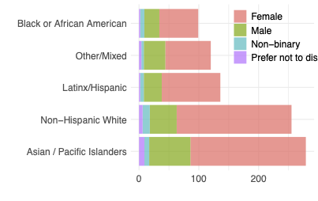
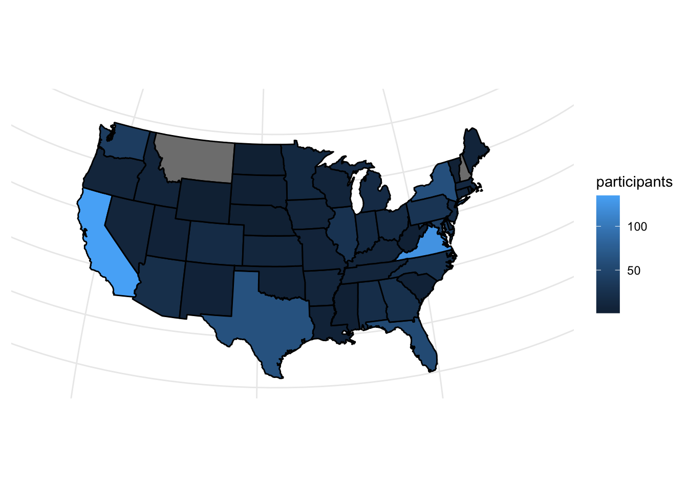
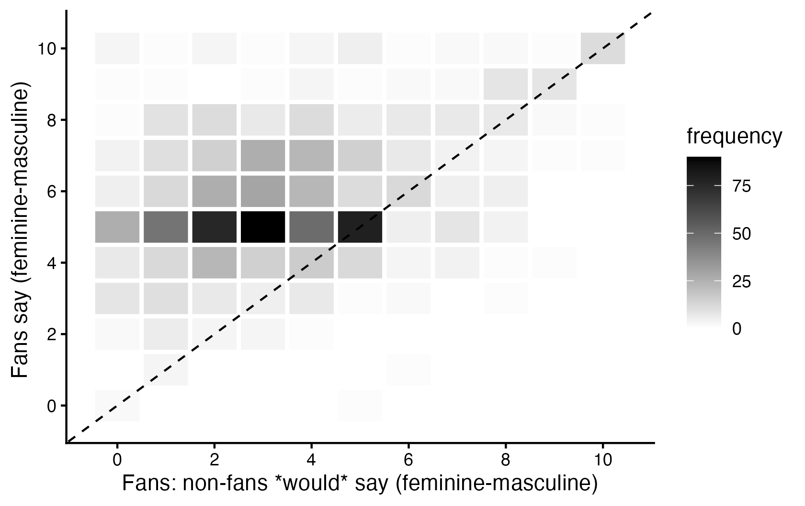

```{r setup, include=FALSE}
# to use FontAwesome
#htmltools::tagList(rmarkdown::html_dependency_font_awesome())

library(fontawesome)
library(dplyr)
library(ggplot2)
library(tinytable)
library(modelsummary)

knitr::opts_chunk$set(warning = FALSE, message = FALSE, error=F, echo=F)
options(htmltools.preserve.raw = FALSE) 

```


background-color: #094e0d
class: inverse, middle
background-image: url(mugshot2025a_circle.png)
background-position: 23cm 2.5cm
background-size: 20%

# .large[K-pop Fans in the United States:] <br> .large[A .yellow[Data-Driven] Approach]<br><br><br>
----

## .right[Byunghwan Ben Son <br> .tiny[(Associate Professor, GLOA, GMU)]]


---


# Before we start:

### The slides are completely .pink[online] and you can easily access it.

```{r, echo=F, include=F}

# library(qrcode)
#  
# png(file="qr.png")
# qr <- qr_code("https://textvulture.github.io/presentations/GuestLecture_GLOA491.html")
# plot(qr)
# dev.off()

```

```{r, fig.align='center', out.width="400px"}

knitr::include_graphics('qr.png')

```

---

.full-width-yellow[
# About the instructor
]
<br><br>
--

.pull-left[

]

--

.pull-right[<br>
- .Large[Associate Prof. of Global Affairs]

- .Large[PhD, .orange[Political Science]]

- .Large[Political Economy; Global Finance; Democratic Backsliding; .red[Political Communication]]

- .Large[Quant. & Mixed methods]

- .Large[[🏠 Webpage](https://textvulture.github.io/)]
]


---

class: inverse, center, middle
background-image: url(https://github.com/textvulture/textvulture.github.io/blob/master/images/forestBackground.jpg?raw=true)
background-size: 100%

# .huge[**Stuff We Talk About**]

--

# K-pop Fans in the United States: A Data-Driven Approach

---

class: inverse, center, middle
background-image: url(https://github.com/textvulture/textvulture.github.io/blob/master/images/forestBackground.jpg?raw=true)
background-size: 100%

# .huge[**Stuff We Talk About**]

# K-pop Fans .yellow[in the United States]: A Data-Driven Approach

---

class: inverse, center, middle
background-image: url(https://github.com/textvulture/textvulture.github.io/blob/master/images/forestBackground.jpg?raw=true)
background-size: 100%

# .huge[**Stuff We Talk About**]

# .yellow[K-pop Fans] in the United States: A Data-Driven Approach

---

class: inverse, center, middle
background-image: url(https://github.com/textvulture/textvulture.github.io/blob/master/images/forestBackground.jpg?raw=true)
background-size: 100%

# .huge[Stuff We Talk About]

# K-pop Fans in the United States: .yellow[A Data-Driven Approach]

---
class: inverse
background-color: black

.full-width-yellow[
# The Big Questions
]

<br>
<br>
--

# 1. How do fans perceive K-pop? Something .Blue[exotic] and .pink[weird]?

--

# 2. Does K-pop have any .orange[real-world] impact on fans?

--

# 3. What do .red[non-fans] think of this?

--

# 4. Can K-pop function as a .Green[public diplomacy] tool?


---

.full-width-yellow[
# Three Readings
]
<br>
--

## - Kim & Son. 2025. "K-pop Fan Perceptions and Negotiation of Alternative Forms of Masculinities," *Journal of Men's Studies*, Forthcoming. <br> .white[.]

--

## - Son & Kim. 2025. "Contours of Fandom Political Activism," Under-Review. <br> .white[.]

--

## - Son. 2024. "Foreign Pop Culture and Backlash: the case of non-fan K-pop Subreddits during the pandemic," *Journal of Cultural Economics*, 48 (1): 117-143. 

---

.full-width-yellow[
# Three Readings
]
<br>


## - Kim & Son. 2025. "K-pop Fan Perceptions and Negotiation of Alternative Forms of Masculinities," *Journal of Men's Studies*, Forthcoming. <br> .hl1[fan perception]


## - Son & Kim. 2025. "Contours of Fandom Political Activism," Under-Review. <br> .hl1[fan reaction]


## - Son. 2024. "Foreign Pop Culture and Backlash: the case of non-fan K-pop Subreddits during the pandemic," *Journal of Cultural Economics*, 48 (1): 117-143. .hl2[.white[non-fan reaction]]

---

class: inverse, center, middle
background-color: green

# .HUGE[**Chapter 1 <br>Fan Perception**]

---
class: inverse, center, middle
background-image: url(https://github.com/textvulture/textvulture.github.io/blob/master/images/forestBackground2.jpg?raw=true)

# How do fans perceive K-pop? Something .Blue[exotic] and .pink[weird]?

---

background-image: url(https://encrypted-tbn0.gstatic.com/images?q=tbn:ANd9GcRt8zTSfK2Bxpi81JfEXFqqdgbI9bt3ofpVzw&s)
background-position: right
background-size: contain

# Why K-pop is a .green[**good subject**]?

--

## - commonly used to describe Asian male in US

--

### : boyish; docile; nerdy; non-threatening; weird; funny-violent; <br> .pink[effeminate]; .pink[asexual]

--

## - exoticization (e.g., Jackie Chan; Ken Jeong)

--

## - Are male K-pop bands also perceived this way?

--

## `r fa('rocket', fill='red')` Is this how K-pop took off ?

---


.full-width-green[
# Alternative Explanations .tiny[(why .pink[not] exotification, but an a .yellow[genuine affection])]
]
<br>
--

### 1. Cultural Proximity Theory .tiny[(Straubhaar 1991; Yang 2012; Cicchelli et al. 2023; Jang & Song 2017)]

### 2. Inclusive Masculinity Theory .tiny[(Anderson 2009; Anderson & Magrath 2019)]

### 3. Hybrid Masculinity & Transcultural Gender Aesthetics .tiny[(Bridges & Pascoe 2014; Jung 2011; Louie 2012; Oh 2015)]

### 4. Global Youth Culture .tiny[(Appadurai 1996; Jin & Yoon 2016)]

### 5. Counter-Hegemonic Masculinity Consumption .tiny[(Hawkins 2009; Whiteneir 2019; Gregory 2019; Anderson & Magrath 2019)]

---

.full-width-green[
# Alternative Explanations .tiny[(why .pink[not] exotification, but an a .yellow[genuine affection])]
]
<br>

### 1. Cultural Proximity Theory .tiny[(Straubhaar 1991; Yang 2012; Cicchelli et al. 2023; Jang & Song 2017)]

- **distance matters**: fans gravitate toward media that feels familiar, emotionally resonant, and symbolically close.
- **K-pop not so new**: circulated through global youth culture—digital platforms, serialized storytelling, shared aesthetics
- **exotification = distance**

### 2. Inclusive Masculinity Theory .tiny[(Anderson 2009; Anderson & Magrath 2019)]

### 3. Hybrid Masculinity & Transcultural Gender Aesthetics .tiny[(Bridges & Pascoe 2014; Jung 2011; Louie 2012; Oh 2015)]

### 4. Global Youth Culture .tiny[(Appadurai 1996; Jin & Yoon 2016)]

### 5. Counter-Hegemonic Masculinity Consumption .tiny[(Hawkins 2009; Whiteneir 2019; Gregory 2019; Anderson & Magrath 2019)]

---

.full-width-green[
# Alternative Explanations .tiny[(why .pink[not] exotification, but an a .yellow[genuine affection])]
]
<br>

### 1. Cultural Proximity Theory .tiny[(Straubhaar 1991; Yang 2012; Cicchelli et al. 2023; Jang & Song 2017)]

### 2. Inclusive Masculinity Theory .tiny[(Anderson 2009; Anderson & Magrath 2019)]

- .large[**Declining homohysteria**: more receptive to diverse gender expressions such as openness, softness, aesthetic refinement.]
- .large[aesthetic fluidity; soft masculinity; comfort with fashion, grooming, and softness.]

### 3. Hybrid Masculinity & Transcultural Gender Aesthetics .tiny[(Bridges & Pascoe 2014; Jung 2011; Louie 2012; Oh 2015)]

### 4. Global Youth Culture .tiny[(Appadurai 1996; Jin & Yoon 2016)]

### 5. Counter-Hegemonic Masculinity Consumption .tiny[(Hawkins 2009; Whiteneir 2019; Gregory 2019; Anderson & Magrath 2019)]


---

.full-width-green[
# Alternative Explanations .tiny[(why .pink[not] exotification, but an a .yellow[genuine affection])]
]
<br>


### 1. Cultural Proximity Theory .tiny[(Straubhaar 1991; Yang 2012; Cicchelli et al. 2023; Jang & Song 2017)]

### 2. Inclusive Masculinity Theory .tiny[(Anderson 2009; Anderson & Magrath 2019)]

### 3. Hybrid Masculinity & Transcultural Gender Aesthetics .tiny[(Bridges & Pascoe 2014; Jung 2011; Louie 2012; Oh 2015)]

- **blending** in multiple gender reportiores from variety of sources
- **pre-existing pattern**: Japanese bishōnen androgyny; Western metrosexuality and pop-idol stylization; globalized fashion/aesthetic literacy
- **nothing new**

### 4. Global Youth Culture .tiny[(Appadurai 1996; Jin & Yoon 2016)]

### 5. Counter-Hegemonic Masculinity Consumption .tiny[(Hawkins 2009; Whiteneir 2019; Gregory 2019; Anderson & Magrath 2019)]

---

.full-width-green[
# Alternative Explanations .tiny[(why .pink[not] exotification, but an a .yellow[genuine affection])]
]
<br>


### 1. Cultural Proximity Theory .tiny[(Straubhaar 1991; Yang 2012; Cicchelli et al. 2023; Jang & Song 2017)]

### 2. Inclusive Masculinity Theory .tiny[(Anderson 2009; Anderson & Magrath 2019)]

### 3. Hybrid Masculinity & Transcultural Gender Aesthetics .tiny[(Bridges & Pascoe 2014; Jung 2011; Louie 2012; Oh 2015)]

### 4. Global Youth Culture .tiny[(Appadurai 1996; Jin & Yoon 2016)]

- **young people**: shared symbolic elements (fashion; emotional narratives; digital fandom)
- fans consume it as youth culture, not "Asian culture."
- **digital platforms**: intensity & accelerate

### 5. Counter-Hegemonic Masculinity Consumption .tiny[(Hawkins 2009; Whiteneir 2019; Gregory 2019; Anderson & Magrath 2019)]


---
.full-width-green[
# Alternative Explanations .tiny[(why .pink[not] exotification, but an a .yellow[genuine affection])]
]
<br>


### 1. Cultural Proximity Theory .tiny[(Straubhaar 1991; Yang 2012; Cicchelli et al. 2023; Jang & Song 2017)]

### 2. Inclusive Masculinity Theory .tiny[(Anderson 2009; Anderson & Magrath 2019)]

### 3. Hybrid Masculinity & Transcultural Gender Aesthetics .tiny[(Bridges & Pascoe 2014; Jung 2011; Louie 2012; Oh 2015)]

### 4. Global Youth Culture .tiny[(Appadurai 1996; Jin & Yoon 2016)]

### 5. Counter-Hegemonic Masculinity Consumption .tiny[(Hawkins 2009; Whiteneir 2019; Gregory 2019; Anderson & Magrath 2019)]

- **minorities** are attracted to masculinities that resist dominant local norms
- softness instead of aggression; emotional expression instead of stoicism; vulnerability instead of dominance.

---

.full-width-green[
# Alternative Explanations .tiny[(why .pink[not] exotification, but an a .yellow[genuine affection])]
]
<br>


### 1. Cultural Proximity Theory .tiny[(Straubhaar 1991; Yang 2012; Cicchelli et al. 2023; Jang & Song 2017)]

### 2. Inclusive Masculinity Theory .tiny[(Anderson 2009; Anderson & Magrath 2019)]

### 3. Hybrid Masculinity & Transcultural Gender Aesthetics .tiny[(Bridges & Pascoe 2014; Jung 2011; Louie 2012; Oh 2015)]

### 4. Global Youth Culture .tiny[(Appadurai 1996; Jin & Yoon 2016)]

### 5. Counter-Hegemonic Masculinity Consumption .tiny[(Hawkins 2009; Whiteneir 2019; Gregory 2019; Anderson & Magrath 2019)]

.Large[`r fa('hand-point-right', fill='purple')` K-pop `r fa('angles-right')``r fa('angles-right')``r fa('angles-right')``r fa('angles-right')` Acceptance of non-traditional masculinities]

---

.full-width-green[
# Data: Survey and Interview
]
<br>
---

## Online Survey (N = 920)
--

- .Large[Conducted via Qualtrics between 2020 and 2021]
--

- .Large[Initial sample: 1710 participants age 17+; 952 were U.S. residents; after multiple validity checks, .red[920] responses were retained for analysis]
--

-	.Large[Recruitment relied on voluntary sampling via online fan communities.]

--

## In-depth Interviews (N = 110)
--

- .Large[Conducted in two phases:]
	- .Large[Phase 1: 57 interviews (2020–2021)]
	- .Large[Phase 2: 53 interviews (2022–2023)]
--

- .Large[Interviews ranged from 30 minutes to 3 hours; .purple[semi-structured]]
--

-	.Large[Mostly conducted via videoconferencing due to the .red[Covid-19 pandemic].]

---
background-image: url(kpopimages/survey_age.png)
background-size: 75%
background-position: bottom


# Survey: Some descriptive data (1)

---

# Survey: Some descriptive data (2)


```{r, echo=F, out.width="80%", fig.align='center'}



```

---

# Survey: Some descriptive data (3)

```{r, echo=F, out.width="80%", fig.align='center'}



```

---

# Survey: Masculinity Perceptions (fans vs. others)

--

<div style="text-align:center;">
  
</div>

---
background-image: url(kpopimages/gender.jpg)
background-position: right
background-size: contain


# Interviews: <br> .purple[keywords] <br>most often invoked

---

.full-width-green[
# Interview: 'K-pop masculinity unique'
]
<br><br>
--

> ### … [T]here’s definitely a .green[difference in how Korean idols and American men], you think, their take on masculinity. I think that American men are very, very tied to masculinity in their physique and male and kind of masculine fashion choices and, and appearances. K-pop, while they also appear very masculine, have a lot of feminine sides as well (White, F, 18).

--

.white[.]
> ### [i]t’s nice because .green[it’s different to how American culture perceives masculinity]. They’re ... a lot more emotionally available. In some cases, like they’re more willing to cry, show emotion and like, be touchy with their friends without it being like, perceived as gay (White, F, 17).

---

.full-width-green[
# Interview: 'normalization of soft masculinty'
]
<br><br>
--

> ### And I think it’s .green[changed my view on what is masculine] and like, like for the longest time I was not used to seeing men express emotions and as much as like K-pop idols do. Like the first year I was kind of like almost awkward when I would see them cry and now I’m like, I expect men to be that emotional, I want to see them express themselves like that. Um, I want to see them take care of themselves like that so it’s, I think, changed my view on masculinity and .green[what is masculine and acceptable for men] (White, F, 26).

---

.full-width-green[
# Interview: 'Negotiating the Stigma'
]
<br><br>
--

> ### ... I had a clear phone case with Jungkook photocard in it and I used to feel self-conscious. Like when people would like to see my phone, ... “who’s that?” .green[I felt kind of ashamed] and like self-conscious about it… somebody that is interested in K-pop would know what those are, but other people be like,"oh, it’s just words in a phone case." (Latine, M, 20)

.white[.]
--

> ### ... other people being like,“how can you find these people attractive? They look like girls.” I’m like ... toxic American masculinity is something that I don’t like … [M]y .green[personal… preference always being sort of like the pretty boy type], which is not really an American.… (White, F, 32) 

---

.full-width-green[
# Conclusion: Perceived K-pop masculinity in the US
]
<br>
--

## - K-pop fans in the U.S. do not exoticize Asian male idols; they interpret K-pop masculinities as .purple[legitimate], attractive alternatives to the US hegemonic masculinity.

--

## - Fans across racial groups recognize Korean/Asian masculinity as culturally different but not deficient, .green[normalizing softness] rather than treating them as strange or feminized.

--

## - The combination of survey and interview evidence: validity `r fa("arrow-up", fill='red')`

---

class: inverse, center, middle
background-color: blue

# .HUGE[**Chapter 2 <br> Fan Impact**]

---

background-image: url(https://s.france24.com/media/display/25804858-7aa7-11eb-8401-005056bf87d6/w:1280/p:3x4/MilkTea.jpg)
background-position: right
background-size: contain

--

# `r fa('hand-back-fist', fill='red')` K-pop fans & youth activism

--

## - Milktea Alliance in SE Asia

--

## - Chilean youth protests 

--

## - S. Korean anti-insurrection protest

--

# `r fa('hand-point-right', fill='blue')`  Does K-pop fandom drive <br> .pink[youth political participation]?


---

class: inverse, middle
background-image: url(https://github.com/textvulture/textvulture.github.io/blob/master/images/forestBackground3.jpg?raw=true)

# This is an important question.

--

# Youth politics literature:

## - Young people hate .pink[politics] and don't want to be .Green[associated] with it.

--

## - Fans only care about .bluey[non-political] social engagement.

--

# *Is K-pop .yellow[different]? How (much)?*

---

background-image: url(kpopimages/KpopTheory.png)
background-position: right
background-size: contain

# **The big idea**

--

## - Fandom is not monolithic.

--

## - 'What K-pop means to you' matters.

--

## - The broader the perception,<br> the more .red[tolerant] of <br>fellow fans' political engagement <br>.purple[in the name of K-pop fans].

---

.full-width-blue[
# Two Political Events where the Fandom was Involved
]
<br>
--

.pull-left[
.Large[**Partisan**: Tulsa Rally Prank]

]

--

.pull-right[
.Large[**Less Partisan**: BTS-BLM]

]
---

.full-width-blue[
# Hypotheses
]
<br><br>
--

.content-box-red[
## H.tiny[1]: Fans who perceive K-pop as transcending entertainment are more likely to support fandom political activism than others.
]

--

.content-box-green[
## H.tiny[2]: This relationship is weaker for highly partisan events (Tulsa prank vs.BLM) -- *'there's a limit to it.'*
]

---

.full-width-blue[
# Data and Operationalization (survey)
]
<br><br>
--

## - same data (survey + interview)

--

## Key Variables (survey):
- .Large[**Outcome**: .red[Support] for fandom activism. Ordered]
- .Large[**Predictor**: Perceived .red[scope] of K-pop. Factor Variable.]

--

## Method: ordered logit (survey)

$$
Attitude_k^i = \beta_1Effect_k^i + \mathbf{X} + ϵ_k^i
$$

---

background-image: url(kpopimages/BLM_Tulsa.png)
background-size: contain
background-position: right

# Survey:<br> at glance


---

class: inverse, center, middle
background-color: #2B1908

# .HUGE[**Chapter 3 <br> Non-Fans**]

---

.full-width-brown[
# The non-fans
]

