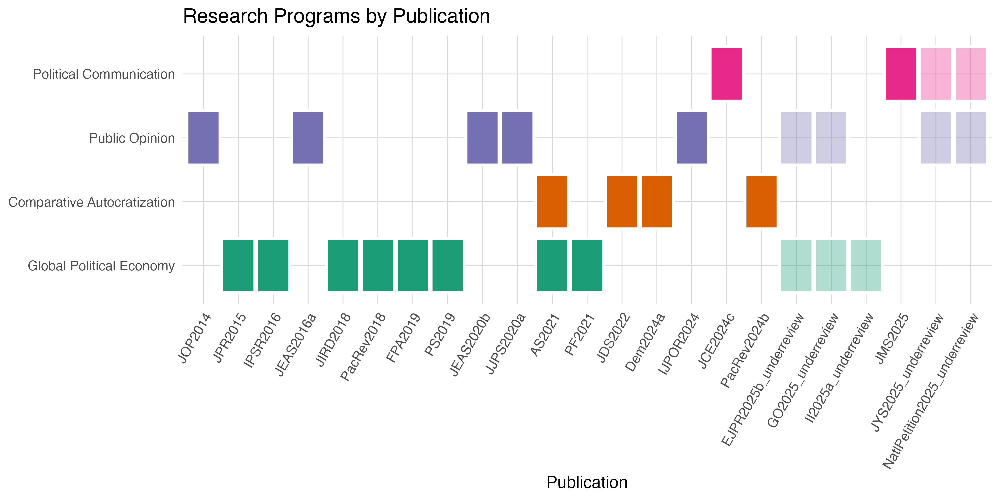
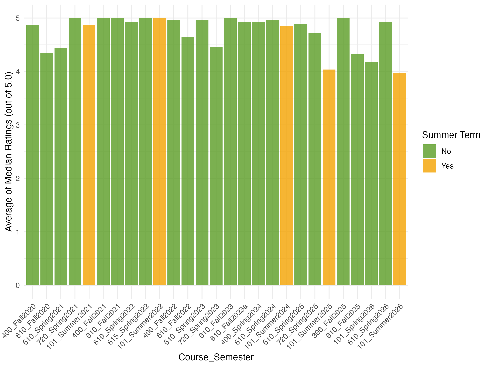
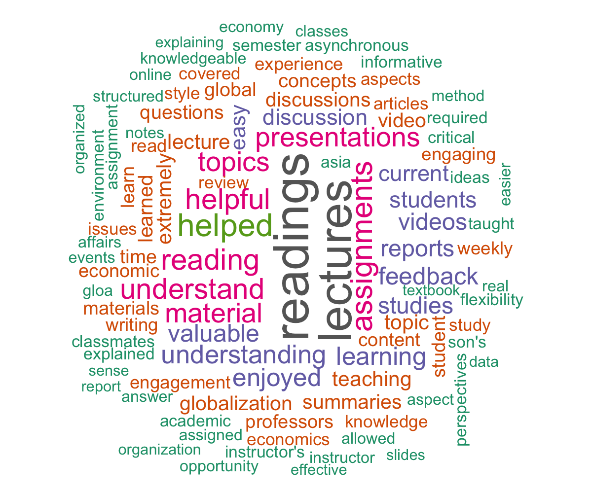

```{r setup, include=FALSE}
# to use FontAwesome
# htmltools::tagList(rmarkdown::html_dependency_font_awesome())
library(fs)
options(htmltools.preserve.raw = FALSE)
library(fontawesome)
knitr::opts_chunk$set(warning = FALSE, message = FALSE, error=F, echo=F)
```

background-color: #094e0d
class: inverse, middle
background-image: url(mugshot2025a_circle.png)
background-position: 23cm 2.5cm
background-size: 20%

# .Large[**RPT Presentation**] <br> .yellow[13 years of research, teaching, and service]<br><br><br>
----

## .right[Byunghwan Ben Son <br> .tiny[(Associate Professor, GLOA)]]

---

class: inverse, center, middle
background-color: black
background-image: url(https://www.typinglounge.com/wp-content/uploads/2013/05/touchtypingtechniques.jpg)
background-size: 120%

# .Huge[.LARGE[**Research**]]

---

class: inverse
background-color: black

# Snapshot of Research: .yellow[18] peer-reviewed journal articles

--

.pull-left[

# .center[.HUGE[9,970]<br>.LARGE[words <br>per paper] ]

]

--

.pull-right[

# .center[.Huge[.Large[.pink[9.2 %]]] average acceptance rate <br> .tiny[(some journals do not disclose the data)]]

]


---


# Research Areas of Published Research

```{r}



```


---

class: inverse, center, middle
background-color: black
background-image: url(https://images.pexels.com/photos/37865915/pexels-photo-37865915/free-photo-of-black-and-white-empty-classroom-interior.jpeg)
background-size: 120%

# .Huge[.LARGE[**Teaching**]]

---
.full-width-green[
## Student Evaluations (average of all questions)]

```{r, out.width="77%%", fig.align='center'}



```

---

.full-width-green[
## Student Evaluations (written)]

```{r, out.width="60%", fig.align='center'}



```


---

class: inverse, center, middle
background-color: black
background-image: url(https://media.licdn.com/dms/image/v2/C4D12AQH6fKBfcbANrQ/article-cover_image-shrink_600_2000/article-cover_image-shrink_600_2000/0/1532639187111?e=2147483647&v=beta&t=ME-XDLSU0qPCJ7wg8K_HVrrvhUe8WhmcxtxrglSnqEE)
background-size: 120%

# .Huge[.LARGE[**Service**]]
