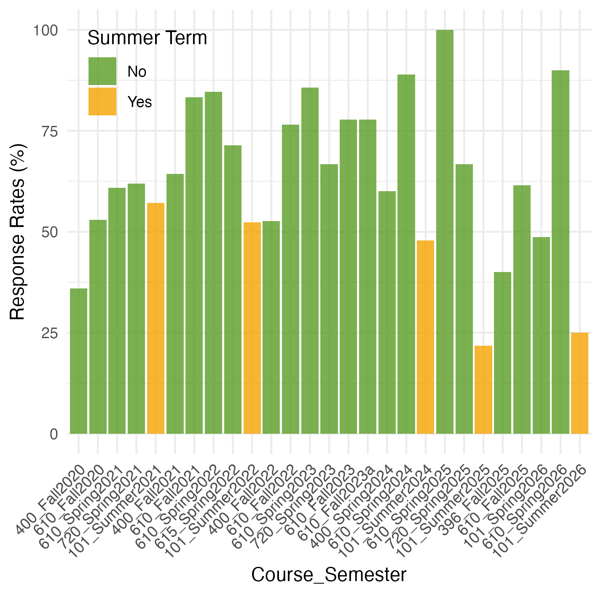
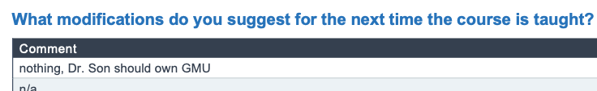

```{r setup, include=FALSE}
# to use FontAwesome
# htmltools::tagList(rmarkdown::html_dependency_font_awesome())
library(fs)
options(htmltools.preserve.raw = FALSE)
library(fontawesome)
knitr::opts_chunk$set(warning = FALSE, message = FALSE, error=F, echo=F)
```

background-color: #094e0d
class: inverse, middle
background-image: url(mugshot2025a_circle.png)
background-position: 23cm 2.5cm
background-size: 20%

# .LARGE[**RPT Presentation**] <br> .yellow[A decade] of .bluey[research], .pink[teaching], and .orange[service]<br><br><br>
----

## .right[Byunghwan Ben Son <br> .tiny[(Associate Professor, GLOA)]]

---

class: inverse, center, middle
background-color: black
background-image: url(https://www.typinglounge.com/wp-content/uploads/2013/05/touchtypingtechniques.jpg)
background-size: 120%

# .Huge[.LARGE[**Research**]]

---

class: inverse
background-color: black

.full-width-blue[
# Research Snapshots: .yellow[18] peer-reviewed journal articles]
<br><br>
--

.pull-left[

# .center[.huge[.Blue[9,970]]<br>words per paper ]

]

--

.pull-right[

# .center[.huge[.pink[9.2 %]]<br> average acceptance rate* ]

]

<br>
--

.pull-left[

# .center[.huge[.orange[10/18]<br>] solo-authored]

]

--

.pull-right[

# .center[.huge[.yellow[3]<br>] current R&R]
]

---

.full-width-blue[
# **Four Research Areas**
]
<br><br>
--

.pull-left[
.content-box-blue[
## Global Political Economy

- .large[political events/institutions: financial outcomes]

]
]

--

.pull-right[
.content-box-red[
## Comparative Autocratization

- .large[processes and consequences of democratic backsliding]
]
]

<br>

--

.pull-left[
.content-box-green[
## Public Opinions

- .large[what do people think about democracy & political institutions?]
]
]

--

.pull-right[
.content-box-yellow[
## Political Communication

- .large[political behaviors found in media/platforms]
]
]


---

.full-width-blue[
# Research Areas of Published Research]
]

```{r, fig.width=14}
library(dplyr)
library(ggplot2)


pubs <- read_csv("publication_categories.csv")

pubs_long <- pubs |>
  mutate(
    status = if_else(str_detect(publication, "_underreview$"), "Under review", "Published"),
    publication = fct_reorder(publication, year)
  ) |>
  pivot_longer(
    cols = c(global_political_economy, comparative_autocratization,
             public_opinion, political_communication),
    names_to = "category",
    values_to = "included"
  ) |>
  filter(included == "Yes") |>
  mutate(category = recode(category,
    global_political_economy   = "Global Political Economy",
    comparative_autocratization = "Comparative Autocratization",
    public_opinion              = "Public Opinion",
    political_communication     = "Political Communication"
  )) |>
  mutate(category = factor(category, levels = c(
    "Global Political Economy",
    "Comparative Autocratization",
    "Public Opinion",
    "Political Communication"
  )))

ggplot(pubs_long, aes(x = publication, y = category, fill = category, alpha = status)) +
  geom_tile(width = 0.95, height = 0.85, color = "white", linewidth = 1) +
  scale_fill_manual(values = c(
    "Global Political Economy"    = "#1b9e77",
    "Comparative Autocratization" = "#d95f02",
    "Public Opinion"              = "#7570b3",
    "Political Communication"     = "#e7298a"
  )) +
  scale_alpha_manual(values = 
                       c("Published" = 1, "Under review" = 0.35), 
                     guide = "none") +
  labs(
#    title = "Research Programs by Publication",
    x = NULL,
    y = NULL
  ) +
  theme_minimal(base_size = 20) +
  theme(
    legend.position = "none",
    axis.text.x = element_text(angle = 60, hjust = 1),
    panel.grid.major = element_line(color = "gray85", linewidth = 0.3),
    panel.grid.minor = element_blank()
  )

```

---
.full-width-green[
# Impact and Recognition
]
<br><br>

--

.pull-left[
.content-box-yellow[
## Direct policy impact
 .Large[🤝 GAO report citation (economic sanctions)]]
]

--

.pull-right[
.content-box-red[
## Media recognition
.Large[📺 MSNBC, Bloomberg, AFP]<br>
.Large[🇰🇷 Korea & Beyond]
]
]
<br>
--

.pull-left[
.content-box-green[
## Regular Think Tank Invitations
.Large[📆 policy forums]<br>
.Large[🚪 closed-door high-level talks]
]
]

--

.pull-right[
.content-box-blue[
## In-discipline recognition
.Large[🏆 Paper award]<br>
.Large[🪑 Leadership roles]
]

]


---

.full-width-blue[
# Going forward:
]
<br>
--

## - Completing the current .purple[seven in-progress] projects.

## - A .red[book] on South Korean insurrection experience.

## - A .green[book] on a positivist approach to K-pop fans' political and social behaviors .tiny[(w/ Dae Young Kim)].


---

class: inverse, center, middle
background-color: black
background-image: url(https://images.pexels.com/photos/37865915/pexels-photo-37865915/free-photo-of-black-and-white-empty-classroom-interior.jpeg)
background-size: 120%

# .Huge[.LARGE[**Teaching**]]

---

class: inverse, center, middle
background-image: url(https://raw.githubusercontent.com/textvulture/textvulture.github.io/refs/heads/master/images/night_background4.jpg)
background-size: 100%


# .LARGE[I've taught .pink[almost all] GLOA courses] <br> .tiny[, except for GLOA 600 and 386-8 (only very recently developed)].

--

.left[# But in particular,
### - GLOA 610 (Economic Globalization & Development) <br>- GLOA 605 (Interdiscplinary Research Methods)  <br>- GLOA 615.yellow[-section] (Globalization in Asia) <br>- GLOA 396.yellow[-section] (Global Politics & Revolutions)
]

---

.full-width-green[
## Student Evaluations (averages of .pink[all] questions)]

--

```{r, out.width="77%%", fig.align='center'}

knitr::include_graphics('average_fixed.png')

```

---

.full-width-green[
## Student Evaluation .violet[Response] Rates.
]

--

```{r, out.width="60%", fig.align='center'}



```

---


.full-width-green[
## Student Evaluations (written)]

--

```{r, out.width="60%", fig.align='center'}

knitr::include_graphics('wordcloud1.png')

```

---

class: inverse, center, middle
background-color: black
background-image: url(https://media.licdn.com/dms/image/v2/C4D12AQH6fKBfcbANrQ/article-cover_image-shrink_600_2000/article-cover_image-shrink_600_2000/0/1532639187111?e=2147483647&v=beta&t=ME-XDLSU0qPCJ7wg8K_HVrrvhUe8WhmcxtxrglSnqEE)
background-size: 120%

# .Huge[.LARGE[**Service**]]

---
.full-width-yellow[
# Multi-dimensional (& likely excessive) Service
]
<br><br>

--


.pull-left[
.content-box-green[
## For GLOA
- .Large[Committees (standing/search)]
- .Large[Presence]
]
]

--

.pull-right[
.content-box-yellow[
## For CHSS
- .Large[KSC & Minor]
- .Large[Committees & other LAUs]
]
]

--

.pull-left[
.content-box-blue[
## For University
- .Large[Academic Standard]
- .Large[Photo modeling]
]
]

--

.pull-right[
.content-box-red[
## For Discipline
- .Large[.Blue[Reviewer]; D&C; Editorial B]
- .Large[AKPS; KPSC]
]
]

---
.full-width-brown[
# So, in conclusion:
]

<br><br><br><br><br>

--


```{r, out.width="120%"}



```

.right[
### - GLOA 610, Spring 2026
]